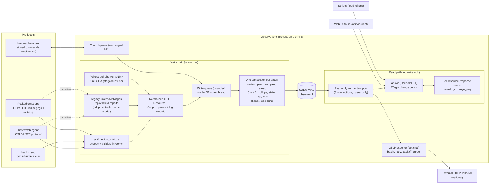

# Observe data and API design: summary tables, /api/v2, OpenTelemetry

Status: design proposal, 2026-10-06. Inputs: the owner decisions of 2026-10-06, the measured review in `the performance review (kept outside the repository)` (cited below as "the review", with its section or item number), `main` and `staged/unifi-ha` of `repos/ipMontior` (read only), `repos/hostwatch` (wire schema `hostwatch/schema.py`, collectors), `repos/ha_Int_soc` and `repos/pocketethernet-app` (`push/ObserveClient.kt`). No repository was changed. The GUI side of the UI work is in the sibling `GUI-DESIGN.md`; this document covers the data layer, the API and the protocols.

Numbers marked "measured" come from the review's x86 bench. Numbers marked "est." are estimates; Pi 3 figures use the review's 8 to 15 times ratio.

---

## 1. Target architecture

### 1.1 Diagram



### 1.2 Write path versus read path

* **One writer.** Every write (ingest, poll results, collectors, control queue, sessions, audit) goes through one `Writer` object that owns the only read-write `sqlite3` connection and runs on one dedicated thread (`ThreadPoolExecutor(max_workers=1, thread_name_prefix="db-writer")`). Callers submit a unit of work (a Python callable taking a `WriteTx`) and await a future. The writer drains the queue and runs each unit in its own `BEGIN IMMEDIATE ... COMMIT`. This replaces `store._lock`, the three transaction idioms and the 82 direct `_db`/`_lock` uses the review counted (review 5, "Duplicated logic"). Because the writer has its own thread, the default thread pool (and therefore asyncio's `getaddrinfo`) never waits for the database (review 4, last paragraph).
* **Batching rule.** A unit of work is one logical batch: one OTLP request, one legacy ingest batch, one UniFi feed cycle, one field report, one poll result. The UniFi classic feed becomes one unit with a SAVEPOINT per device so one bad device is skipped without rolling back the cycle (review item 2).
* **Summary maintenance happens inside that unit.** The latest table, 5 minute and 1 hour rollups, current monitor state and current map are updated in the same transaction as the raw rows, so a reader never sees raw data without its summaries.
* **Readers never take the write lock.** Reads use a small pool of connections opened with `mode=ro` URIs and `PRAGMA query_only=ON`. WAL gives each read transaction a stable snapshot while the writer commits. Reads run on a separate read executor (3 threads), not the default pool.
* **Change sequence.** Each write unit bumps a per-domain counter in the `change_seq` table (`domain TEXT PRIMARY KEY, seq INTEGER`; domains: `metrics`, `hosts`, `monitors`, `events`, `map`, `ports`, `unifi`, `ha`, `audit`, `admin`). The writer also mirrors the counters in memory after commit. API responses derive their ETag and cursor from these counters, so an unchanged page costs a dictionary lookup and a 304.
* **CPU work moves off the event loop.** OTLP decode, JSON parse and validation run in the read executor (they do not touch the database), then the normalized batch is handed to the writer. This is review item 11.

---

## 2. Storage model

### 2.1 Resources and series identity

OpenTelemetry identifies a stream by Resource attributes, InstrumentationScope, metric name and point attributes. Observe stores those as three small tables and one integer id per series.

```sql
CREATE TABLE resources (
  id          INTEGER PRIMARY KEY,
  key_hash    BLOB NOT NULL UNIQUE,      -- 16 bytes of BLAKE2b over canonical resource attributes
  kind        TEXT NOT NULL,             -- host | network_device | port | ha_instance | unifi_client | monitor | field_tester | service
  name        TEXT NOT NULL,             -- display name, e.g. host.name or device name
  attrs       TEXT NOT NULL,             -- canonical JSON of identifying resource attributes
  first_seen  REAL NOT NULL,
  last_seen   REAL NOT NULL
);
CREATE INDEX resources_kind_name ON resources(kind, name);

CREATE TABLE scopes (
  id        INTEGER PRIMARY KEY,
  name      TEXT NOT NULL,               -- e.g. hostwatch.collector.hwmon, observe.poller.unifi
  version   TEXT NOT NULL DEFAULT '',
  UNIQUE(name, version)
);

CREATE TABLE series (
  id          INTEGER PRIMARY KEY,
  key_hash    BLOB NOT NULL UNIQUE,      -- BLAKE2b-128 of (resource key_hash, metric name, canonical point attrs)
  resource_id INTEGER NOT NULL REFERENCES resources(id),
  scope_id    INTEGER NOT NULL REFERENCES scopes(id),
  metric      TEXT NOT NULL,             -- OTEL name, e.g. hw.temperature
  unit        TEXT NOT NULL,             -- UCUM, e.g. Cel, By, 1, W, {rpm}
  instrument  TEXT NOT NULL,             -- gauge | sum | histogram
  monotonic   INTEGER NOT NULL DEFAULT 0,
  temporality TEXT NOT NULL DEFAULT '',  -- cumulative | delta | '' for gauge
  attrs       TEXT NOT NULL,             -- canonical JSON of point attributes
    first_seen  REAL NOT NULL,
  last_seen   REAL NOT NULL
);
CREATE INDEX series_resource_metric ON series(resource_id, metric);
CREATE INDEX series_metric ON series(metric);
```

The console shows a reading by its unit through `static/js/format.js`: `1` as a percentage, `By` as KiB to EiB, `Hz`, `bit/s` and `By/s` with SI prefixes, and `s` as a duration.

* **Canonical form.** Attribute maps are sorted by key, values typed (string, int, double, bool; arrays and maps are rejected for identity attributes), serialized with `json.dumps(separators=(",", ":"), sort_keys=True)`. The scope is not part of the series identity, so a metric does not split into two series when a collector is renamed; it is stored for provenance. *Implemented (slice r2-series-schema): until the normalizer gives every producer one OpenTelemetry metric namespace, the scope (the hostwatch source) is part of the key, because two sources can send the same metric name for one host.*
* **Identifying resource attributes.** Only a fixed allow-list per kind enters `resources.key_hash` (for a host: `host.name`, plus `host.id` when sent). Descriptive attributes (`os.type`, `os.version`, `service.version`, `host.arch`) are stored on the resource row but changing them does not create a new resource. This keeps an agent upgrade from forking every series.
* **Lookup cost.** *Implemented without the cache: a series lookup is one indexed read on `key_hash`, and an LRU filled inside a write unit could hold an id from a transaction that rolled back.* The writer was designed to keep an in-memory LRU of `key_hash -> series_id` (4,096 entries, about 0.5 MB est.). A batch of 40 known series costs zero series lookups; a new series costs one `INSERT ... ON CONFLICT DO NOTHING RETURNING id`.
* **Cardinality guard.** At most 2,000 series per resource and 50,000 total (configurable). Points for a series beyond the cap are dropped and counted in `observe.ingest.dropped{reason="cardinality"}`. Compaction removes a series that has no raw sample and no summary row left, with its `latest` row, and a resource that has no series left, so churned labels free their place under the caps once retention has trimmed their data (`collect_dead_series` in `observe/storage/compaction.py`). On TimescaleDB the continuous aggregates must also be empty for the series, which retention policies bring about.

### 2.2 Samples

```sql
CREATE TABLE samples (
  series_id INTEGER NOT NULL,
  ts        INTEGER NOT NULL,   -- unix milliseconds
  value     REAL,               -- NULL means "source present, no value this cycle" (hostwatch rule)
  PRIMARY KEY (series_id, ts)
) WITHOUT ROWID;
```

* No secondary index. Retention prune walks `series` and deletes `WHERE series_id = ? AND ts < ?` per series, which is an index range on the primary key. With 50,000 series as the cap this is at most 50,000 small deletes per hour, batched 500 per transaction; at the review's scale (160 series) it is trivial.
* Duplicate points (same series and ms) are stored once with `INSERT ... ON CONFLICT DO NOTHING`, which is also the idempotency mechanism for retried OTLP requests (section 6.5). A point sent again with a different value replaces the stored value and corrects its summaries (section 2.4). *`INSERT OR REPLACE` is not portable to PostgreSQL and is refused by the storage layer.*
* Histograms (only the exporter-facing self-metrics and possibly HA durations need them) go to a separate `hist_samples(series_id, ts, count, sum, min, max, bounds TEXT, counts TEXT)` table so the hot table stays three columns.
* Sum metrics store the value as received. Cumulative sums keep `start_time_unix_nano` in `series_resets(series_id, start_ts)` when it changes, so rate queries can detect a counter reset.

### 2.3 Latest table

```sql
CREATE TABLE latest (
  series_id INTEGER PRIMARY KEY,
  ts        INTEGER NOT NULL,
  value     REAL,
  prev_ts   INTEGER,
  prev_value REAL
) WITHOUT ROWID;
```

Upserted per point: `INSERT INTO latest(...) VALUES(...) ON CONFLICT(series_id) DO UPDATE SET prev_ts=ts, prev_value=value, ts=excluded.ts, value=excluded.value WHERE excluded.ts >= latest.ts`. The `>=` keeps the review's tie-break rule (item 1). `prev_*` lets the API give a rate for cumulative counters (for example interface octets) without touching `samples`. Measured cost for the equivalent `host_latest` experiment: 0.06 ms per read, 0.13 ms extra per 40-point batch (review section 4, query plans).

### 2.4 Rollup tables

```sql
CREATE TABLE rollup_5m (
  series_id INTEGER NOT NULL,
  bucket    INTEGER NOT NULL,   -- unix milliseconds, floor to 300000
  n         INTEGER NOT NULL,   -- non-null points
  sum_v REAL, min_v REAL, max_v REAL,
  PRIMARY KEY (series_id, bucket)
) WITHOUT ROWID;
CREATE TABLE rollup_1h ( ...same columns, bucket floor to 3600000... ) WITHOUT ROWID;
CREATE TABLE rollup_1d ( ...same columns, bucket floor to 86400000... ) WITHOUT ROWID;
```

* **Maintenance at ingest.** *Implemented as written in section 10.2 (three levels, count, sum, min, max; the `last` columns are not stored, and the views show the bucket in whole seconds).* For each point the writer runs one upsert per rollup: `INSERT INTO rollup_5m VALUES (?,?,1,?,?,?,?,?) ON CONFLICT DO UPDATE SET n=n+1, sum=sum+excluded.sum, min=min(min,excluded.min), max=max(max,excluded.max), last=CASE WHEN excluded.last_ts>=last_ts THEN excluded.last ELSE last END, last_ts=max(last_ts,excluded.last_ts)`. Using `executemany` the three extra statements per point (latest, 5m, 1h) cost about 0.13 ms each per 40-point batch on x86 by analogy with the measured latest upsert, so about 0.4 ms per batch (est.), against the measured 0.76 ms p50 batch today. The review's HTTP ingest total of 4.83 ms p50 is dominated by parsing and commit, not these upserts.
* **Duplicates and replays.** A replaced point (same series and ts) would double count in `n` and `sum`. The writer first does `INSERT OR IGNORE INTO samples` and only updates rollups for rows where `changes() = 1`. A true replace (different value for the same ts, rare) is corrected at once, with no dirty table: the 5 minute bucket is recomputed from raw samples, and a coarser bucket from the level below when that level still holds all of it, otherwise its count and sum are adjusted by the difference and its extremes widened.
* **Null values** count toward nothing except `last_ts`, so gaps stay visible.
* **Sums.** For monotonic cumulative sums the rollup stores the last value per bucket (`last`) and the API computes rate as the difference of `last` across buckets, handling resets via `series_resets`.

### 2.5 Retention and downsampling

| Tier | Default retention | Rows at review scale (160 series, 30 s) | Est. size |
|---|---|---|---|
| `samples` raw | 48 hours | 921,600 | about 25 MB (about 27 bytes per row in a WITHOUT ROWID B-tree, est.) |
| `rollup_5m` | 35 days | 1.6 M | about 75 MB |
| `rollup_1h` | 400 days | 1.4 M | about 65 MB |
| `latest` | live series | 160 | negligible |

Retention is per tier and configurable, plus per-metric overrides (for example keep raw `observe.monitor.latency` for 7 days). Prune runs from the hourly maintenance in chunks of 5,000 rows per transaction so the writer queue never stalls for more than about 50 ms on the Pi (est.). After prune, `PRAGMA optimize` and `PRAGMA wal_checkpoint(PASSIVE)` run (review item 7).

*Retention is implemented as section 10.2 states it (levels, bounds and defaults), with the compaction described in the implementation status below.*

**Size reduction.** The review measured 1,907 MB for 30 days with 13.8 M `host_samples` rows, about 138 bytes per row including the two indexes. The same 30 days in the new layout is about 25 MB raw plus about 75 MB 5 minute rollups plus the 1 hour tier, so **about 110 to 170 MB, a reduction of about 91 to 94 percent (est.)**. This matches the review's own estimate for item 9 (150 to 250 MB). Slice O-4 is dropped (section 11), so the real figure is not measured on a migrated database.

The `results` table (1.9 M rows for 40 monitors over 30 days) moves into the same model: each pull monitor is a resource of kind `monitor` with series `observe.monitor.up`, `observe.monitor.latency`, so it gains the same rollups and loses its own `hourly_series()` GROUP BY (13.1 ms measured, review section 4). The `results` table is no longer written or read (slice o10-perf-ingest, section 11: no migration path); a poll is stored only as series points.

### 2.6 Current state tables

These are the "current monitor state" and "current map" from the owner decision. They are written by the writer in the same unit as the event that changes them.

```sql
CREATE TABLE monitor_state (
  monitor_id   TEXT PRIMARY KEY,   -- slug
  state        TEXT NOT NULL,      -- up | down | degraded | unknown | stale | blocked
  since        REAL NOT NULL,
  last_ts      REAL NOT NULL,
  last_latency REAL,
  message      TEXT NOT NULL DEFAULT '',
  detail       TEXT NOT NULL DEFAULT '{}',  -- capped at 16 KB; large detail is a separate resource
  blocked_by   TEXT,
  availability_24h REAL,                    -- maintained from rollup_1h hourly
  seq          INTEGER NOT NULL             -- change_seq at last change
) WITHOUT ROWID;

CREATE TABLE host_state (
  resource_id  INTEGER PRIMARY KEY,
  last_seen    REAL NOT NULL,
  heartbeat    REAL,
  platform     TEXT, agent_version TEXT, producer TEXT,
  boot_id      TEXT, boot_ts REAL, clean_shutdown INTEGER,
  sources      TEXT NOT NULL DEFAULT '{}',  -- source -> {available, present, reason, updated}
  grade        TEXT, grade_detail TEXT,     -- result of hostview grading, recomputed at ingest
  seq          INTEGER NOT NULL
);

CREATE TABLE map_nodes (id TEXT PRIMARY KEY, kind TEXT, label TEXT, site TEXT, attrs TEXT, state TEXT, seq INTEGER) WITHOUT ROWID;
CREATE TABLE map_edges (id TEXT PRIMARY KEY, a TEXT, b TEXT, kind TEXT, attrs TEXT, state TEXT, seq INTEGER) WITHOUT ROWID;
CREATE TABLE port_current (switch_id TEXT, port_key TEXT, attrs TEXT, matches TEXT, findings TEXT, seq INTEGER,
                           PRIMARY KEY (switch_id, port_key)) WITHOUT ROWID;
```

* `host_state.grade` replaces calling `hostview.build_host_view()` on every GET. Grading reads `latest` for that resource only (40 rows, 0.06 ms measured) and runs in the writer after the batch is applied. The pushed-host monitor then reads `host_state` and `latest`, never `samples`, which removes the 8.36 s per call (review item 1).
* Staleness cannot be computed at write time because it depends on the clock. The hourly writer task does not handle it; instead the scheduler's existing pushed-host monitor marks `stale` on transition (one write per transition), and the API compares `last_seen` with `now` for display.
* The map tables are rebuilt by the existing 60 s hook (`mapper.refresh()`) and by infra writes, never by `GET /api/infra/map` (review item 3). `port_current.matches` is computed once per rebuild from `effective_matches()`, removing the N+1 (259 statements per request measured).

Built in slice r4-one-transaction-feeds (schema version 18, `observe/map_tables.py`): the three tables above, with `site` and `attrs` carrying what the read needs, so `GET /api/infra/map` is two statements and filters in memory. A UniFi classic or Integration cycle (`write_cycle` in `observe/infra.py`) and a Pockethernet upload (`store_and_derive`) are each one write unit with a SAVEPOINT per device, port, link or derivation (`observe.storage.savepoint`), and the map tables are rebuilt inside that unit, writing only the rows that changed and bumping `map` and `ports` only then. The write unit cannot see monitor state, so it carries the live columns over; the 60 second hook (`MapService.tick`) computes them in one pass (`MapService.rebuild`), and the admin link and acknowledge routes rebuild at once. `InfraTx` is the transaction-bound form of `InfraService`. Live PostgreSQL cases run when `OBSERVE_TEST_PG_DSN` is set; the dialect fake runs them otherwise.

### 2.7 Events and logs

```sql
CREATE TABLE logs (
  id            INTEGER PRIMARY KEY,
  resource_id   INTEGER NOT NULL,
  scope_id      INTEGER NOT NULL,
  ts            INTEGER NOT NULL,       -- time_unix_nano / 1e6
  observed_ts   INTEGER NOT NULL,
  severity_num  INTEGER NOT NULL,       -- OTEL 1..24
  severity_text TEXT NOT NULL,
  event_name    TEXT NOT NULL,          -- OTEL event.name, e.g. observe.monitor.transition
  body          TEXT NOT NULL,          -- string body; structured bodies stored as JSON
  attrs         TEXT NOT NULL DEFAULT '{}',
  dedup_key     TEXT,                   -- hostwatch dedup_key or OTLP-derived key
  trace_id      BLOB, span_id BLOB,
  UNIQUE (resource_id, dedup_key)
);
CREATE INDEX logs_ts ON logs(ts);
CREATE INDEX logs_resource_ts ON logs(resource_id, ts);
CREATE INDEX logs_event_ts ON logs(event_name, ts);
```

This replaces `events` (monitor transitions), `host_events` and the Pockethernet report "events". `logs_resource_ts` fixes the review's `events(monitor=?)` scan (item 8). Audit stays in its own `audit` table: it is a security record with its own retention and redaction and must not be exported by default. It is exposed through the API, not merged into logs.

Field reports keep their raw JSON in the Pockethernet plugin's `reports` table (it is the replay source for `rebuild()`), and each report also produces one log record (`observe.pockethernet.report`) plus metrics.

### 2.8 Migration from current tables

Dropped by section 11. There is no migration path: Observe is destroyed and redeployed, so the dual write, the backfill, the verification, the cut-over and the legacy rename described in earlier versions of this section do not exist, and the `host_samples` table is gone. The core schema creates the tables of section 2 directly (migrations 16 and 17). A database created by an earlier build (one that still has a `host_samples` table) is refused at start with `LegacySchemaError`, because the migration steps were renumbered in place; delete it and start empty.

### 2.9 SQLite pragmas

Writer connection: `journal_mode=WAL`, `synchronous=NORMAL`, `foreign_keys=ON` (the review found them declared but unenforced), `busy_timeout=5000`, `cache_size=-16000` (16 MB), `temp_store=MEMORY`, `mmap_size=67108864`, `wal_autocheckpoint=1000`, `journal_size_limit=67108864`.

Read connections: opened with `file:/data/observe.db?mode=ro` and `uri=True`, then `query_only=ON`, `cache_size=-8000` (8 MB each), `temp_store=MEMORY`, `mmap_size=67108864` (the mapping is shared by the OS page cache, so it is not paid three times). Total cache budget 16 + 3 x 8 = 40 MB, acceptable on a 1 GB Pi.

### 2.10 Read connection pool

* Three connections (configurable 1 to 6), created at start-up, held in a `queue.Queue`. A request borrows one inside the read executor, runs its queries in one `BEGIN DEFERRED` read transaction (one consistent snapshot per response), and returns it.
* If the pool is empty for more than 2 s the request returns 503 with `Retry-After: 2` rather than queueing indefinitely.
* WAL checkpoint starvation: long reads block checkpoint completion. Read transactions are capped at 2 s by a progress handler (`set_progress_handler` every 10,000 VM steps checks the deadline), which also protects the Pi from an expensive ad hoc query.

### 2.11 Locks that remain

Implementation status (slices r1 and r1b): the `Storage` protocol, the SQLite writer and read pool, the pragmas above, the `change_seq` table (migration 17) and the ban test exist. Slice r1b added the PostgreSQL backend (`observe/storage/postgres.py`, psycopg 3 and psycopg-pool), the `storage.backend`, `storage.dsn`, `storage.password_file` and `storage.timescaledb` config keys, the TimescaleDB hypertable, continuous aggregates and policies (`pg_timescale.py`), the shared incremental rollups and retention levels (`rollups.py`, migration 18: `rollup_5m`, `rollup_1h`, `rollup_1d`, `rollup_state` and the views `metric_5m`, `metric_hourly`, `metric_daily`, `availability_history`), the compose `postgres` profile and the CI workflow. Those summary tables were keyed by the old `host_samples` columns; slice r2-series-schema rekeyed them to `series_id`. Units of work still carry SQLite-flavoured SQL with `?` placeholders; the PostgreSQL connection rewrites them (`pg_dialect.py`). The PostgreSQL contract cases run in CI and skip locally when `OBSERVE_TEST_PG_DSN` is not set. Slice r3-state-and-rules.1.1 added a PostgreSQL dialect fake (`tests/fakes/pg_fake.py`) that runs the re-check and summary-view reads through the PostgreSQL rewrite without a server, plus `tests/test_pg_summary.py`; it found no dialect gap in the existing reads. Slice r1b-postgres.3 added the admin page `GET /admin/retention` (`observe/retention_page.py`, `admin-retention.js`) that edits the settings through `PUT /api/admin/retention` and shows the last compaction and rollup run from `rollup_state`, whose new `last_error` column and `compaction` row the maintenance loop fills; it names the backend and never the DSN. Slice r1b-postgres.2 added the validated, audited write of the retention, compaction and rollup settings (`observe/retention.py`, `Storage.save_retention_settings`, admin-only `GET` and `PUT /api/admin/retention`), per-metric overrides applied by the shared retention code and mapped to the TimescaleDB policies (longest level per chunk; aggregates cannot be trimmed per metric). Slice r2-series-schema (the storage half of O-2) removed `host_samples` and the fold-from-raw rollups. Migration 16 adds `resources`, `scopes`, `series`, `samples` (integer milliseconds, primary key `(series_id, ts)`) and `latest`, and migration 17 adds `rollup_5m`, `rollup_1h`, `rollup_1d` (count, sum, min, max, bucket in milliseconds), `rollup_state` and the views, which now carry `series_id, resource, scope, metric, unit, attrs, bucket (seconds), n, sum_v, min_v, max_v, avg_v`. `observe/storage/series.py` records points inside the ingest unit: a new point updates `latest` and, on SQLite and plain PostgreSQL, the three levels in the same transaction, so a replay changes nothing and arrival order does not matter; on TimescaleDB `samples` is a hypertable on milliseconds and the levels are continuous aggregates, with `Storage.incremental_rollups` telling the writer which. `observe/storage/compaction.py` trims raw samples and then the 5 minute, hourly and daily levels in chunks of 5,000 rows, per series (so per-metric overrides work), after verifying that the levels above still count the rows about to go; a failure keeps the series and is recorded in `rollup_state`. On TimescaleDB raw chunks are dropped by `PgStorage.drop_raw` after a refresh and the same check, and the aggregates are trimmed by policy. The late-sample grace setting and `Storage.rollup` are gone, because nothing is folded later. Not done in this slice: the OpenTelemetry normalizer and the section 3.2 mapping (the hostwatch source is the scope and its labels are the point attributes), the cardinality counter metric, histograms and `series_resets`, and the ingest timing measurement on the review database. The PostgreSQL and TimescaleDB paths were written against the same contract tests but could not be run in the session that wrote them, so CI is their first real run. Slice r1b-postgres.1 made the application queries portable (aggregates cast to plain `int` and `float`, no boolean sums, `FLOOR` hour buckets, aliased subqueries, `rowid` rewritten to `ctid`), added contract cases for them, and hardened the TimescaleDB setup (autocommit, bucket-aligned refresh windows and policy offsets, `integer_now` registered before the policies).


| Lock | Why it stays |
|---|---|
| SQLite's own WAL write lock | held only by the writer thread; nothing else writes |
| The writer queue (asyncio future per unit) | serializes writes in submission order |
| Per-monitor `asyncio.Lock` in the scheduler | prevents overlapping polls of one monitor; unrelated to the DB |
| Control queue enqueue limits | enforced inside one writer unit, so no extra lock |
| In-memory caches (series id LRU, change_seq mirror, response cache) | touched only by the writer thread (LRU, seq) or guarded by a `threading.Lock` held for microseconds (response cache) |

`store._lock`, `store._db`, `Store._run` and `Store._exec` are removed (slice r1). `Store` keeps its public method names as thin wrappers that build units for `store.storage`, and plugins use `store.storage.write`, `read`, `write_sync` and `read_sync`; `tests/test_storage_ban.py` fails the build if code under `observe/` or `plugins/` imports a driver, opens a connection or touches the removed names. The read deadline in section 2.10 is implemented as a `StorageBusy` error when no connection is free within 2 s and a `StorageTimeout` when a read passes 2 s; mapping them to 503 belongs to the `/api/v2` slice.

---

## 3. OpenTelemetry mapping

Units are UCUM as OTEL requires (`Cel`, `By`, `W`, `V`, `s`, `1` for ratios, `{rpm}` and similar curly-brace annotations for counts). Utilization metrics are ratios 0 to 1, not percent, so hostwatch `*_pct` values are divided by 100 at the agent (or in the legacy adapter). Instrument types: G gauge, S sum (M monotonic, C cumulative), H histogram.

### 3.1 Resource attributes

| Producer | Resource kind | Identifying attributes | Descriptive attributes |
|---|---|---|---|
| hostwatch agent | host | `host.name` | `host.id` (machine-id), `host.arch`, `os.type`, `os.description`, `os.version`, `service.name=hostwatch`, `service.version`, `service.instance.id`, `observe.platform` (linux, windows, truenas, rpi) |
| ha_Int_soc | ha_instance (also a host when it reports the HA machine) | `host.name` of the HA machine, `service.name=home-assistant`, `service.instance.id` (HA instance uuid) | `service.version` (HA core), `observe.ha.installation_type`, `observe.producer=ha_Int_soc` |
| Observe HA poller (staged/unifi-ha `ha_host`) | same as above | same | `observe.producer=observe.ha_poller` |
| SNMP with `host_name` | host or network_device | `host.name` (when set) else `observe.device.id` | `observe.snmp.sys_object_id`, `observe.device.vendor` |
| UniFi poller, device | network_device | `observe.device.id` (UniFi MAC, normalized) | `observe.device.name`, `observe.device.model`, `observe.device.vendor=ubiquiti`, `observe.site`, `service.version` (firmware) |
| UniFi poller, client | unifi_client | `observe.client.mac` | `host.name` (hostname if known), `observe.site` |
| UniFi Protect camera | network_device | `observe.device.id` | `observe.device.kind=camera` |
| Pull monitor | monitor | `observe.monitor.id` (slug) | `observe.monitor.kind` (icmp, tcp, http, dns, snmp, ssh, winrm, ha, truenas, proxmox, pushed_host), `server.address`, `server.port`, `observe.group` |
| Pockethernet app | field_tester | `observe.field.device` (the key's bound device label) | `observe.field.tester_serial`, `service.name=pockethernet-app`, `service.version` |
| Port measured by Pockethernet or UniFi | port | `observe.device.id` (switch), `observe.port.key` | `observe.port.label`, `observe.jack.label`, `observe.site`, `observe.room`, `observe.panel` |
| thermal-control (via hostwatch) | host | the host's `host.name` | scope name `hostwatch.collector.thermalctl` or `win_thermalsuite` |
| Observe itself | service | `service.name=observe`, `service.instance.id` | `service.version`, `host.name` of the Pi |

Scope: `hostwatch.collector.<source>` (version = agent version), `observe.poller.<plugin>`, `observe.check.<kind>`, `pockethernet.app`.

### 3.2 hostwatch collectors

Point attributes in the right column replace hostwatch labels. `observe.source` is not added as an attribute; the scope already carries it.

| Source / metric (unit) | OTEL metric | Unit | Type | Point attributes |
|---|---|---|---|---|
| cpu/utilization_pct (%) | `system.cpu.utilization` | 1 | G | none (whole host) or `cpu.logical_number` when per core |
| cpu/load (labels `window`) | `system.cpu.load_average.1m`, `.5m`, `.15m` | {thread} | G | none |
| cpu/freq_mhz | `system.cpu.frequency` | Hz (value x 1e6) | G | `cpu.logical_number` |
| cpu/idle_residency_pct | `observe.cpu.idle_residency` | 1 | G | `observe.cpu.idle_state` |
| win_cpu/utilization_pct | `system.cpu.utilization` | 1 | G | none |
| memory/mem_total, win_memory/mem_total | `system.memory.limit` | By | G | none |
| memory/mem_available | `system.memory.usage` with `system.memory.state=free`-style split: emit `system.memory.usage{state=used}` = total minus available and `system.memory.usage{state=free}` = available | By | G | `system.memory.state` |
| memory/swap_total, swap_free | `system.paging.usage` | By | G | `system.paging.state` (used, free) |
| hwmon/temp (C) | `hw.temperature` | Cel | G | `hw.id` (chip + sensor), `hw.name` (sensor label), `hw.parent` (chip) |
| hwmon/fan (RPM) | `hw.fan.speed` | {rpm} | G | `hw.id`, `hw.name`, `hw.parent` |
| hwmon/voltage (V) | `hw.voltage` | V | G | `hw.id`, `hw.name` |
| hwmon/power (W) | `hw.power` | W | G | `hw.id`, `hw.name` |
| rapl/watts | `hw.power` | W | G | `hw.id=rapl:<zone>`, `hw.type=cpu`, `observe.rapl.domain` |
| rpi/soc_temp | `hw.temperature` | Cel | G | `hw.id=soc`, `hw.type=cpu` |
| rpi/throttle_flag | `observe.rpi.throttled` | 1 | G (0/1) | `observe.rpi.flag` |
| rpi/throttled_raw | `observe.rpi.throttled_raw` | 1 | G | none |
| mdraid/array_state | `hw.status` | 1 | G (0/1 per state) | `hw.id=md:<array>`, `hw.type=logical_disk`, `hw.state` (the state string) |
| mdraid/sync_action | `observe.mdraid.sync_action` | 1 | G | `hw.id`, `observe.mdraid.action` |
| mdraid/sync_progress_pct | `observe.mdraid.sync_progress` | 1 | G | `hw.id` |
| zfs/pool_state, truenas/pool_state | `hw.status` | 1 | G | `hw.id=zpool:<pool>`, `hw.type=logical_disk`, `hw.state` |
| truenas/pool_health, pool_healthy, pool_warning | `observe.zfs.pool.health` (0 ok, 1 warning, 2 critical), `hw.status{hw.state=healthy}` | 1 | G | `hw.id` |
| truenas/pool_scan_errors | `observe.zfs.pool.scan.errors` | {error} | G | `hw.id` |
| truenas/read_errors, write_errors, checksum_errors and `vdev_*` variants | `hw.errors` | {error} | S (M, C) | `hw.id` (pool or vdev), `error.type` (read, write, checksum) |
| truenas/vdev_self_healed_bytes | `observe.zfs.vdev.self_healed` | By | S (M, C) | `hw.id` |
| truenas/scan_state | `observe.zfs.pool.scan.state` | 1 | G | `hw.id`, `observe.zfs.scan_state` |
| truenas/disk_temp_c | `hw.temperature` | Cel | G | `hw.id=disk:<name>`, `hw.type=physical_disk` |
| scrutiny/api_up | `observe.scrutiny.up` | 1 | G | `error.type` when 0 |
| scrutiny/device_status | `hw.status` | 1 | G | `hw.id=disk:<wwn>`, `hw.type=physical_disk`, `observe.scrutiny.status` |
| win_storage/disk_health, pool_health, virtual_disk_health | `hw.status` | 1 | G | `hw.id`, `hw.type` (physical_disk, logical_disk), `hw.state`, `observe.win.operational` |
| win_storage/smart_passed | `hw.status{hw.state=smart_ok}` | 1 | G | `hw.id` |
| win_storage/media_errors | `hw.errors` | {error} | S (M, C) | `hw.id`, `error.type=media` |
| win_storage/wear_pct | `hw.physical_disk.endurance_utilization` | 1 | G | `hw.id` |
| nut/battery_charge_pct | `hw.battery.charge` | 1 | G | `hw.id=ups:<name>` |
| nut/battery_runtime_s | `hw.battery.time_left` | s | G | `hw.id` |
| nut/input_voltage_v | `hw.voltage` | V | G | `hw.id`, `hw.type=power_supply` |
| nut/ups_load_pct | `observe.ups.load` | 1 | G | `hw.id` |
| nut/ups_status_flag | `observe.ups.status` | 1 | G (0/1) | `hw.id`, `observe.ups.flag` |
| thermalctl/zone_temp, win_thermalsuite/zone_temp | `hw.temperature` | Cel | G | `hw.id=zone:<zone>`, `observe.thermal.zone` |
| thermalctl/zone_load, win_thermalsuite/zone_load | `observe.thermal.zone.load` | 1 | G | `observe.thermal.zone` |
| win_thermalsuite/zone_duty | `observe.thermal.zone.duty` | 1 | G | `observe.thermal.zone` |
| thermalctl/fan_duty, win_thermalsuite/fan_duty | `observe.thermal.fan.duty` | 1 | G | `hw.id=fan:<header>` |
| thermalctl/fan, win_thermalsuite/fan | `hw.fan.speed` | {rpm} | G | `hw.id=fan:<header>`, `observe.thermal.controlled=true` |
| win_thermalsuite/fan_target | `observe.thermal.fan.target_duty` | 1 | G | `hw.id` |
| win_thermalsuite/failsafe | `observe.thermal.failsafe` | {reason} | G | none; reasons go to a log record |
| Batch.sources (SourceStatus) | `observe.source.available` (0/1) and `observe.source.present` (0/1) | 1 | G | `observe.source`, plus `observe.source.reason` as a log on change |
| agent heartbeat (sent_at) | `observe.agent.heartbeat` | s | G | none |

Any collector metric not in the table maps through the legacy adapter to `observe.legacy.<source>.<metric>` with unit converted where obvious, and the adapter logs the unmapped pair once per process. This guarantees no data loss when hostwatch adds a collector before Observe's table is updated.

### 3.3 Thermal controller states

| State | OTEL |
|---|---|
| controller mode (auto, manual, failsafe, off) | `observe.thermal.mode` G (0/1) with `observe.thermal.mode` attribute; transitions as log `observe.thermal.mode_change` |
| failsafe reasons | log `observe.thermal.failsafe` severity WARN, attributes `observe.thermal.reason` |
| status file age | `observe.thermal.status_age` s G |
| curve target per zone | `observe.thermal.zone.target_temperature` Cel G |

### 3.4 Home Assistant (ha_Int_soc and the staged/unifi-ha poller)

From the golden files ha_Int_soc sends, copied into `tests/fixtures/observe_otlp` (the README there names the source commit). The source column below is the pre-OpenTelemetry source and metric the row replaced; those names are gone from Observe.

| Source / metric | OTEL metric | Unit | Type | Attributes |
|---|---|---|---|---|
| ha_container/cpu_percent | `container.cpu.utilization` | 1 | G | `container.name` |
| ha_container/memory_percent | `container.memory.utilization` | 1 | G | `container.name` |
| ha_container/memory_usage_bytes | `container.memory.usage` | By | G | `container.name` |
| ha_container/running | `observe.ha.container.running` | 1 | G | `container.name` |
| ha_supervisor/healthy, supported | `observe.ha.supervisor.healthy`, `.supported` | 1 | G | none |
| ha_supervisor/unhealthy_reasons | `observe.ha.supervisor.unhealthy_reasons` | {reason} | G | reasons as a log |
| ha_backup/backups_total | `observe.ha.backup.count` | {backup} | G | none |
| ha_backup/last_backup_ok | `observe.ha.backup.last_ok` | 1 | G | none |
| ha_backup/last_success_age_hours | `observe.ha.backup.last_success_age` | s (x 3600) | G | none |
| ha_integrations/loaded_total, error_count_24h | `observe.ha.integration.count`, `observe.ha.integration.errors` | {integration}, {error} | G | `observe.ha.integration` for per-integration rows |
| ha_repairs/issue, issues_total, open, open_total | `observe.ha.repair.issues` | {issue} | G | `observe.ha.repair.state` (open, all), `observe.ha.repair.domain` |
| ha_watchdog/breach_count | `observe.ha.watchdog.breaches` | {breach} | G | `observe.ha.watchdog.rule` |
| ha_crash_forensics/* | log records `observe.ha.crash` | | | severity ERROR for `kernel_fault` and `silent_stop`, WARN for `core_restart`, INFO for `clean_reboot`; body summary; attributes `observe.boot_id`, `observe.ha.crash.classification`, `observe.ha.crash.gap_seconds`, `observe.ha.crash.suspects`. Observe reads the classification as the boot kind `boot.<classification>`: `kernel_fault` and `silent_stop` are unclean, `core_restart` and `clean_reboot` clean, and the severity is kept |
| Pulled by Observe's Home Assistant monitor (host mode) | `observe.ha.running`, `.safe_mode`, `.recovery_mode`, `.version`, `.update.pending`, `.update.count`, `.entity.count`, `.entity.unavailable`, `.soc.*`; `container.cpu.utilization`, `container.memory.utilization`; `system.filesystem.usage`, `.limit`, `.utilization` | 1, {entity}, {update}, By | G | scopes `observe.check.homeassistant`, `observe.check.hassio`, `observe.check.ha_soc`; `observe.ha.component`, `observe.ha.domain`, `observe.ha.entity_id`, `container.name`, `system.filesystem.state` |
| HA REST check (pull monitor) | `observe.monitor.up`, `observe.monitor.latency` | 1, s | G | monitor resource |
| Future HA detail (entities ha_Int_soc will push) | `observe.ha.entity.state` for numeric entities | entity unit mapped to UCUM | G | `observe.ha.entity_id`, `observe.ha.domain`, `observe.ha.device_class` |

A host whose resource has no `os.type` but that sends a metric or a log named `observe.ha.*` is platform `homeassistant`.

Implementation status (slice o5-ha-otel): the `ha`, `containers`, `integrations`, `repairs` and `backups` sections of the host view read these names from the scopes `ha_soc.collector.<name>` (what HA SOC sends) and `observe.check.*` (what the pull monitor writes), `tests/test_ha_push.py` checks the golden files against expected grades, and the old Home Assistant keys are removed from the host view, the monitor and the tests. Container, CPU and memory ratios are graded at 0.85 and 0.95; backup age is in seconds and graded at 36 h and 72 h.

### 3.5 SNMP

| Metric | OTEL | Unit | Type | Attributes |
|---|---|---|---|---|
| snmp/if_in_bps, if_out_bps | `network.io` is a cumulative counter in OTEL; Observe stores the derived rate as `observe.network.interface.rate` and, when the octet counters are available, also `system.network.io` | bit/s; By | G; S (M, C) | `network.interface.name`, `network.io.direction` (receive, transmit) |
| errors, discards | `system.network.errors`, `system.network.dropped` | {error}, {packet} | S (M, C) | same |
| sysUpTime | `system.uptime` | s | G | none |
| storage (test_snmp_storage) | `system.filesystem.usage`, `system.filesystem.utilization` | By, 1 | G | `system.filesystem.mountpoint`, `system.filesystem.state` |
| CPU, memory where the MIB offers it | `system.cpu.utilization`, `system.memory.utilization`, `system.memory.limit`, `system.memory.usage` | 1, 1, By, By | G | as for hosts |

Implementation status (slice o4-snmp-otel): `host_batch` in `observe/checks/snmp.py` stores the readings of an `snmp` monitor with `host_name` in the scope `observe.check.snmp`. It writes `system.cpu.utilization` (ratio; `cpu.logical_number` for one core), `system.memory.utilization`, `system.memory.limit` and `system.memory.usage{system.memory.state=used}`, `system.filesystem.utilization` and `system.filesystem.usage` (By, `system.filesystem.state` used or free, per `system.filesystem.mountpoint`), and for an interface `observe.network.interface.up` (with `observe.network.interface.status`), `observe.network.interface.rate` (bit/s, `network.io.direction` receive or transmit), `observe.network.interface.speed` (bit/s) and `observe.network.interface.utilization` (ratio), all with `network.interface.name`. The host view grades them with the old limits as ratios, so the same values give the same Good, Warning or Critical. Not done: the octet counters (`system.network.io`), errors and discards, and `system.uptime` are not stored, because the poller does not read them yet.

### 3.6 Pull monitor results

| Field | OTEL | Unit | Type |
|---|---|---|---|
| status | `observe.monitor.up` (1 up, 0 down) | 1 | G |
| status detail | `observe.monitor.state` (0/1 per state) | 1 | G, attribute `observe.monitor.state` |
| latency | `observe.monitor.latency` | s | G (H optional later) |
| HTTP status | `observe.monitor.http.status_code` | 1 | G, attribute `http.response.status_code` |
| TLS days left | `observe.monitor.tls.expiry` | s | G |
| forecast | `observe.monitor.forecast` | depends | G |

### 3.7 UniFi

| Data | OTEL | Unit | Type | Attributes |
|---|---|---|---|---|
| device up/state | `observe.device.up`, `observe.device.state` | 1 | G | device resource |
| device CPU, memory | `system.cpu.utilization`, `system.memory.utilization` | 1 | G | device resource |
| device uptime | `system.uptime` | s | G | |
| device temperature | `hw.temperature` | Cel | G | `hw.id` |
| device fan level | `observe.device.fan.level` | 1 | G | |
| port link up, speed | `observe.port.up`, `observe.port.speed` | 1, bit/s | G | `network.interface.name`, `observe.port.key` |
| port bytes, packets, errors, drops | `system.network.io`, `system.network.packets`, `system.network.errors`, `system.network.dropped` | By, {packet}, {error}, {packet} | S (M, C) | `network.interface.name`, `network.io.direction` |
| PoE power, voltage, current, class | `observe.poe.power`, `observe.poe.voltage`, `observe.poe.current`, `observe.poe.class` | W, V, A, 1 | G | `observe.port.key` |
| PoE budget | `observe.poe.budget.limit`, `observe.poe.budget.usage` | W | G | device |
| client counts | `observe.unifi.clients` | {client} | G | `observe.site`, `observe.unifi.connection` (wired, wireless) |
| client signal, rates, bytes | `observe.wifi.signal_strength` (dBm), `observe.wifi.rate`, `system.network.io` | dBm, bit/s, By | G, G, S | client resource |
| Protect camera online, recording | `observe.camera.up`, `observe.camera.recording` | 1 | G | device resource |
| LLDP/uplink links | map edges, not metrics; changes as logs `observe.map.link_change` | | | |

Client presence is high churn (500 clients). Only the counts and per-client signal and bytes are metrics; the client table itself stays a current-state table (`unifi_clients`) exposed by the API, which avoids 500 resources times many series on the Pi. Per-client metrics are off by default (`unifi.client_metrics: false`).

### 3.8 Pockethernet properties

Each report creates one log record and gauges on the port resource. Gauges carry the report timestamp so they appear as samples on the port's timeline.

| Property | OTEL | Unit | Type |
|---|---|---|---|
| link_speed_mbps | `observe.pockethernet.link.speed` | bit/s (x 1e6) | G |
| poe_class | `observe.poe.class` | 1 | G, attribute `observe.measured_by=pockethernet` |
| poe_load_w | `observe.poe.power` | W | G, same attribute |
| poe_voltage_v | `observe.poe.voltage` | V | G, same attribute |
| cable length, pair status (wiremap, TDR) | `observe.pockethernet.cable.length` (m), `observe.pockethernet.pair.status` (0/1 per status) | m, 1 | G, attribute `observe.pockethernet.pair` |
| lldp / cdp neighbor | log attributes (`network.peer.name`, `observe.lldp.port_id`); they feed the map | | |
| jack_label, room, panel, site | port resource attributes | | |
| tester_serial | resource attribute `observe.field.tester_serial` | | |
| report outcome | log `observe.pockethernet.report`, severity INFO or WARN when a measurement fails | | |

### 3.9 Events to OTEL logs

| Current event | `event.name` | Severity (number, text) | Body | Attributes |
|---|---|---|---|---|
| Monitor transition (`events` table) | `observe.monitor.transition` | down 17 ERROR, degraded 13 WARN, up 9 INFO | "mon07 down: connection refused" | `observe.monitor.id`, `observe.monitor.state.previous`, `observe.monitor.state`, `observe.monitor.blocked_by` |
| hostwatch Event, severity info / warning / critical | `hostwatch.<kind>` (for example `hostwatch.boot.clean_shutdown`, `hostwatch.md.degraded`) | info 9 INFO, warning 13 WARN, critical 17 ERROR, with `observe.severity=critical` kept as an attribute | `title` | `detail` keys flattened under `observe.detail.*` (capped), `observe.source`, `observe.boot_id`, `observe.dedup_key` |
| Boot classification | `observe.host.boot` | 9 or 13 | "booted, clean shutdown" | `observe.boot_id`, `observe.host.clean_shutdown` |
| Source availability change | `observe.source.change` | 13 | "zfs unavailable: permission denied" | `observe.source`, `observe.source.reason` |
| Pockethernet report | `observe.pockethernet.report` | 9 / 13 | summary | `observe.report.id`, port attributes |
| Map link change | `observe.map.link_change` | 9 | "sw1:7 now links to ap-lobby" | `observe.port.key`, `network.peer.name` |
| Control command lifecycle | `observe.control.command` | 9 / 13 | "reboot requested by admin" | `observe.command.id`, `observe.command.state`; actor only when audit export is enabled |
| HA repairs, crash forensics | `observe.ha.repair`, `observe.ha.crash` | 13 / 17 | title | HA ids |
| Alert delivery failure | `observe.alert.delivery_failed` | 17 | target and error | target name only, never the URL |

Implementation status (slice oc1-host-view-rules): the consumers of pushed host data read these names. The host view (`observe/hostview.py`), the pushed host check and the threshold rules are keyed by the scope `hostwatch.collector.<source>` and the OpenTelemetry metric of section 3.2, with the point attributes as the labels, and the old `(source, metric)` keys such as `(cpu, utilization_pct)` are gone. The golden files the agent publishes are copied into `tests/fixtures/otel` (with the source commit in the README there) and `tests/test_otel_contract.py` sends them through protobuf, decode, normalize and ingest and checks every point lands in a host page group with the expected grade. Ratios are graded as ratios: CPU utilization Warning at 0.90 and Critical at 0.98, the computed `system.memory.utilization` (used over limit) at 0.90 and 0.97, UPS charge Warning at 0.50 and Critical at 0.20, UPS load at 0.80 and 0.95, and SSD wear at 0.80 and 0.95; the limits in a monitor's `components` are ratios too. `hw.status` is graded by its `hw.state` attribute (a point of 0 says the object is not in that state and claims nothing), except for the Windows storage and Scrutiny sources where the value is the level itself, and a Windows `hw.status` shows under disks for `hw.type=physical_disk` and under raid for `logical_disk`. A metric the agent could not map arrives as `observe.legacy.<source>.<metric>` and is graded as the reading it carried. Log records are read back as the agent writes them: `observe.event.kind` (a boot classification, sent with `event.name` `observe.host.boot`) is the event kind, a `hostwatch.` prefix on `event.name` is removed, `observe.severity` is the severity (so a critical power loss, sent as WARN, stays critical), and the `observe.detail.` prefix is removed from detail keys. The `require_sources` list keeps the collector ids the agent reports in `observe.source`. A threshold rule for a pushed collector series names the OpenTelemetry metric (`hw.temperature`) and applies to every series of that name on its host. Slice o3-rules-legacy: `PUT /api/admin/rules` refuses a rule whose metric is an old `<collector>.<metric>` name with 422 that names the replacement and the unit change (`cpu.utilization_pct` to `system.cpu.utilization`, now a ratio), and a stored rule with such a name is listed by `GET /api/v2/admin/settings/rules` with an `invalid` sentence (null for a usable rule) and shown as invalid in the console. There is no v2 write route for rules yet, so the `PUT` is the only write path. The Home Assistant sources moved to the section 3.4 names in slice o5-ha-otel. Not done in this slice: the console shows ratios as the raw number with the unit `1`.

Implementation status (slice oc2-boot-and-severity): boot classification runs on the golden boot logs (`observe.host.boot` with the kind in `observe.event.kind`): clean, power loss, panic, watchdog reset, agent stopped and a kind this version has not seen are classified, the host row keeps the newest `boot_id` and `clean_shutdown`, and the crash check fires for a crash. `observe.severity` is the stored severity, so a critical power loss sent as WARN is stored and alerted as critical. A log record `observe.source.change` also sets the status of the source named in `observe.source`: its reason is `observe.source.reason`, and it is available when the body is `<source> available`. The reason then shows on the host page like one sent in the `observe.source.available` gauge. The record is kept as an event as well. The tests are in `tests/test_otel_contract.py`.

---

## 4. /api/v2 resource model and OpenAPI outline

### 4.1 Principles

* JSON only, `application/json; charset=utf-8`. Timestamps are RFC 3339 strings in responses and accept RFC 3339 or unix seconds in query parameters.
* FastAPI generates the schema; every route has explicit pydantic request and response models, examples and an `operationId`. The schema is served at `/api/v2/openapi.json` and committed to the repo as `docs/openapi-v2.json`; CI fails if the generated schema differs from the committed file, so changes are reviewed.
* Reads never write. Session `last_seen` is updated at most once per 60 s (review item 4) by submitting a low-priority unit to the writer, never inline.

### 4.2 Resources

| Path | Methods | Purpose | Backed by |
|---|---|---|---|
| `/api/v2/resources` | GET | list resources, filter `kind`, `name`, `attr.<key>=<value>`, `seen_since` | `resources` |
| `/api/v2/resources/{id}` | GET | one resource with attributes and series summary | `resources`, `series` |
| `/api/v2/hosts` | GET | host summaries: grade, last_seen, sources, key latest values | `host_state`, `latest` |
| `/api/v2/hosts/{name}` | GET | one host view (replaces `/api/hosts/{host}`) | `host_state`, `latest`, `logs` (last 50) |
| `/api/v2/waiting-hosts` | GET | enrolled hosts that have not sent a batch (added in slice r5-api-v2-core) | `enrolments`, `hosts` |
| `/api/v2/status` | GET | the Observe version and the delivery state of each alert target (added in slice r5-api-v2-core) | scheduler and alerter memory |
| `/api/v2/hosts/{name}/settings` | GET, PATCH | host settings (admin) | existing host settings |
| `/api/v2/metrics` | GET | catalogue: metric names, units, types, series counts, `attr` keys | `series` |
| `/api/v2/metrics/query` | GET, POST | time series query (below) | `samples`, `rollup_5m`, `rollup_1h` |
| `/api/v2/metrics/latest` | GET | latest values for a selector | `latest` |
| `/api/v2/monitors` | GET | monitor list with state and rollup (detail omitted unless `include=detail`) | `monitor_state`, scheduler memory |
| `/api/v2/monitors/{id}` | GET, PATCH | one monitor; PATCH for pause, ack (admin) | |
| `/api/v2/monitors/{id}/detail` | GET | large check detail (UniFi port, HA mode) | `monitor_state.detail` |
| `/api/v2/groups` | GET | groups and their rolled-up state | memory, `monitor_state` |
| `/api/v2/events` | GET | OTEL log records, filter `resource`, `event_name`, `severity_min`, `since`, `until` | `logs` |
| `/api/v2/map` | GET | nodes and edges for a site | `map_nodes`, `map_edges` |
| `/api/v2/map/nodes`, `/api/v2/map/edges` | GET | paged lists | same |
| `/api/v2/ports` | GET | ports with current properties, findings, matches | `port_current` |
| `/api/v2/ports/{switch}/{port}` | GET | one port with property history | `port_current`, `port_properties`, metrics |
| `/api/v2/findings` | GET, POST (`/{id}/ack`) | infra findings | `port_current.findings`, `infra_finding_acks` |
| `/api/v2/unifi/devices`, `/api/v2/unifi/devices/{id}` | GET | UniFi devices | plugin tables plus `latest` |
| `/api/v2/unifi/clients` | GET | clients, paged, filter `site`, `connected`, `q` | `unifi_clients` |
| `/api/v2/unifi/cameras` | GET | Protect cameras | |
| `/api/v2/ha/instances`, `/api/v2/ha/instances/{id}` | GET | HA instances: supervisor, backups, repairs, integrations | `latest`, `logs` |
| `/api/v2/field-reports`, `/{id}` | GET | Pockethernet reports (read; upload stays OTLP or legacy) | plugin table |
| `/api/v2/audit` | GET | audit log (admin) | `audit` |
| `/api/v2/admin/keys` | GET, POST, DELETE | ingest, control, field and read keys (admin) | `ingest_keys` |
| `/api/v2/admin/users`, `/admin/sessions` | GET, POST, PATCH, DELETE | users (admin) | |
| `/api/v2/admin/config` | GET | effective configuration with secrets redacted | |
| `/api/v2/admin/exporter` | GET | exporter status (the settings are in the config file, section 6.6) | |
| `/api/v2/updates/status` | GET | running version and commit, the upstream check, the open update request and the host helper's state (admin, README "Updating") | files under `server.update_dir` |
| `/api/v2/updates/agents` | GET | every pushed host with its control daemon state and whether an agent update can be queued (admin) | `hosts`, `ingest_keys`, `enrolments` |
| `/api/v2/admin/maintenance/*` | POST | prune now, rebuild rollups, drop legacy | writer |
| `/api/v2/session` | GET, POST, DELETE | current user, login, logout | |
| `/api/v2/changes` | GET | change cursor for all domains (below) | `change_seq` |
| `/api/v2/plugins` | GET | loaded plugins and the resources they register | |

### 4.3 Metrics query

`GET /api/v2/metrics/query?metric=hw.temperature&match[host.name]=nas01&match[hw.type]=physical_disk&from=-24h&to=now&step=300&agg=avg,max&limit_series=50`

* Selection by metric name (exact or `prefix*`), resource attributes and point attributes (`match[key]=value`, `match[key]!=value`, `match[key]=~pattern`, a wildcard pattern where `*` is any run of characters and `?` one character, matched against the whole value (`~nas*` is a prefix match), at most 64 characters, run by a linear-time matcher over the first 256 characters of the value; there is no regular expression syntax), or explicit `series_id`.
* `step` is rounded up to the best tier: raw if `step < 300` and the range is inside raw retention, `rollup_5m` if `step < 3600` and inside its retention, else `rollup_1h`. The response states the tier used. A query may span tiers; each bucket comes from the finest tier that covers it.
* At most 1,000 points per series (`step` is raised to fit) and 50 series per response; this fixes the review's truncation bug (item 10) and its 877 KB seven-day response.
* `agg`: `avg`, `min`, `max`, `last`, `sum`, `count`, `rate` (sums only).
* POST accepts the same as a JSON body for long selectors.
* Response: `{"tier":"rollup_5m","step":300,"series":[{"id":..,"metric":..,"unit":..,"resource":{..},"attrs":{..},"points":[[ts, avg, max], ...]}]}` with columnar points to keep size down.

### 4.4 Pagination, filtering, sorting

* Cursor pagination everywhere a list can exceed 200 items: `?limit=100&cursor=<opaque>`; response `{"items":[...],"next_cursor":"...|null"}`. The cursor encodes the sort key and id, so inserts do not shift pages. `limit` max 500.
* Filters are plain query parameters named after fields; attribute filters use `match[...]`. Sorting with `sort=field,-other` on an allow-list per resource.
* Sparse fields: `fields=id,name,state` and `include=detail,latest` expansions.

### 4.5 ETag and change cursor

* Each resource declares the change domains it depends on (for example `/hosts` depends on `hosts`, `metrics`). The ETag is `W/"<route hash>-<seq of each domain>-<query hash>"`. If `If-None-Match` matches, the server returns 304 without opening a read connection. The exception is `/hosts`, whose ETag is a digest of the rows shown: the first request after a change counter or the 10 second clock bucket moves reads the database to rebuild the digest (the host rows plus one list read unit), then answers 304 or a cached page without a further read. A busy database therefore gives that request a 503 even when a cached body exists. The digest leaves out `last_seen` and `age_seconds`, so a 304 or cached list can show them up to one 10 second bucket old; a grade change moves the digest at once.
* The response cache stores the last rendered body per (route, query, role) with its ETag, at most 4 MB total, so repeated identical requests from several tabs cost one render per change.
* `/hosts` is the exception to the counters: every ingest bumps `hosts`, `metrics` and `events`, so its ETag is instead a digest of the rows it shows (without `last_seen` and `age_seconds`, which move with every batch) plus the 10 second clock bucket. A batch that changes no shown value keeps the ETag and gets a 304. The list is built from 5 statements however many hosts there are.
* `GET /api/v2/changes?since=<cursor>&wait=25` is a long poll: it returns immediately when any domain has a sequence above the cursor, else after `wait` seconds (max 30) with an unchanged cursor. Body: `{"cursor":"..","changed":["metrics","hosts"]}`. The UI uses it to decide which resources to refetch (section 5). This is one open request per tab and costs no database access.
* `metrics` changes every ingest (every few seconds), so pages that show metric charts refetch at most once per their own interval even when the cursor reports a change.
* **Static files and compression (October audit, optimisations 4 and 6).** Files under `/static/` (and a plugin's static directory) are sent with `Cache-Control: no-cache` plus the ETag and Last-Modified of the file, so the browser keeps them and revalidates; an unchanged file is a 304 with no body. Every other response, the HTML pages and the login page included, keeps `no-store`. Responses of 1,024 bytes or more are gzipped when the client sends `Accept-Encoding: gzip` (and `Vary: Accept-Encoding` is set). A 2 series by 2,880 point metrics query of 126,194 bytes is about 31,153 bytes on the wire; the decoded body is identical.

### 4.6 Error model

RFC 9457 problem details, `application/problem+json`:

```json
{"type":"https://observe.local/problems/validation","title":"Invalid query","status":400,
 "detail":"step must be at least 1 second","instance":"/api/v2/metrics/query",
 "errors":[{"loc":["query","step"],"msg":"must be >= 1"}],"request_id":"01J..."}
```

Types: `validation` 400, `unauthenticated` 401, `forbidden` 403, `not-found` 404, `conflict` 409, `precondition-failed` 412 (If-Match on PATCH), `payload-too-large` 413, `rate-limited` 429 with `Retry-After`, `busy` 503 (read pool exhausted, writer queue full) with `Retry-After`, `internal` 500 (no stack traces).

### 4.7 Authentication and authorization

* **Session** for the UI: the existing HttpOnly, SameSite strict cookie plus CSRF header on unsafe methods.
* **Read tokens** for scripts: a new key scope `read` with prefix `wpr_` in `ingest_keys`, created by an admin, optionally restricted to a list of resource kinds and to read-only roles. `Authorization: Bearer wpr_...`. Stored as SHA-256 digest like the other keys. `last_used` updated at most once per 60 s.
* **Roles**: `viewer` (all GETs except audit and admin), `operator` (plus monitor pause and finding ack), `admin` (everything). Read tokens are `viewer` or `operator`; never `admin`.
* **Open dashboard mode**: today read routes are open when basic auth is unset (review section 3). v2 keeps this only behind an explicit `server.anonymous_read: true` (default false), and even then `audit`, `admin` and `ha` detail require a session. The legacy routes keep their current behaviour until removed.
* Ingest keys (`wpi_`), control keys (`wpc_`) and field keys (`wpf_`) are not accepted on `/api/v2` reads, and neither is HTTP basic auth, which now opens only `/metrics` and the page shells. A read token is never accepted by ingest.

### 4.8 Rate limits

Token bucket per principal (session user or token) and per peer for anonymous: 20 requests per second burst 40 for viewers; `/metrics/query` counts 5 tokens; long polls on `/changes` count 1 per request. Over limit returns 429. Limits are in memory and reset on restart.

Ingest (slice o7-auth-limits): `POST /v1/metrics` and `/v1/logs` are limited per ingest key (`server.ingest_rate_per_minute`, default 120 a minute, with a 429 and `Retry-After`), never per peer for a valid key, so hosts behind one NAT or proxy do not throttle each other; one host needs about 8 a minute. Missing or wrong keys are limited per peer. Login is limited per peer and across all peers (`server.login_global_per_minute`), and a failed password locks only the account and peer pair, with a delay that doubles at each further lockout.

### 4.9 Versioning and deprecation of /api

* `/api/v2` is stable: additive changes only (new fields, new resources, new optional parameters). A breaking change means `/api/v3`.
* *Superseded by section 11 and built in slices r5-api-v2-core and r6-api-v2-resources:* the legacy `/api/*` read routes for monitors, groups, forecasts, events, monitor history and hosts were removed outright, with no adapter, no `Deprecation` or `Sunset` headers and no window. Slice r6 did the same for the map, ports, findings, audit and plugin list reads (`/api/infra/map`, `/api/infra/port`, `/api/infra/findings`, `/api/audit`, `/api/plugins`) and for the finding acknowledgement route. The reads left on legacy routes (the user and key lists the admin page draws, the session read, the settings reads next to their `PUT`, the host settings and enrolment documents, the dependency and unlinked-switch lists and the UniFi and Pockethernet page routes) moved with the pages in slice r8-ui-client, section 5.4, which removed them with no adapter.
* Ingest routes (`/internal/v1/ingest`, `/api/ingest`, `/api/v1/field-reports`) and the control API (`/api/v1/control/*`) are not part of v2 and follow the producer window in section 7.

### 4.10 Plugin API resources

A plugin registers resources through the existing plugin interface with a new hook:

```python
def register_api(api: ApiRegistry) -> None:
    api.resource(
        path="/unifi/devices", model=UnifiDeviceList, handler=list_devices,
        domains=["unifi", "metrics"], roles=["viewer"], tags=["unifi"],
        paginate=True, filters=UnifiDeviceFilter)
```

* `ApiRegistry` mounts the route under `/api/v2/<path>`, wires auth, ETag, caching, the read pool (the handler receives a read connection, never the writer), rate limits and problem details. Plugins cannot register outside their prefix (`/unifi`, `/ha`, `/pockethernet`, `/control`).
* Writes from plugin handlers go through `api.submit_write(unit)`.
* A plugin declares its change domains at load time; writes it submits bump those domains.
* The plugin's models appear in the OpenAPI schema under its tag; the committed schema check covers them.
* `GET /api/v2/plugins` lists each plugin's resources and UI page manifest so the UI shell builds navigation from data.

### 4.11 Built in slice r5-api-v2-core (O-6)

`observe/api` implements this section for the monitors, groups, hosts, events and metrics
resources and the change cursor. The design and its reasons are in `docs/ARCHITECTURE.md`, "The
v2 read API"; the committed schema is `docs/openapi-v2.json` (`python -m observe.api.schema`
writes it, a test compares it).

What differs from the text above, and what is left:

* **Mounting.** The API is a sub-application mounted at `/api/v2`, so the problem-details handlers
  and the schema are its own. `ApiRegistry.resource` takes `domains`, `roles`, `tags`,
  `paginate`, `filters`, `sparse`, `anonymous`, `cost`, `memory` (a fingerprint of in-memory
  state for the ETag, plain or async), `counters` (False leaves the declared domains out of the ETag) and `etag`; a handler may ask for `ctx`, `db` (a read-only connection),
  `page` and `filters`. A query model in `filters` is expanded into one query parameter per field,
  because FastAPI flattens a query model only when it is the only query parameter.
* **ETag.** It carries the full path and the query (not only the route), the role, the counters of
  the declared domains and the memory fingerprint. A resource whose body depends on the clock adds
  a time bucket: hosts 10 seconds, events and the metrics query 60 seconds. The monitors and
  groups ETag uses `Scheduler.fingerprint`, because state changes in memory after its poll was
  stored. The waiting-hosts resource sends no ETag, because enrolment writes bump no change
  domain.
* **Credentials.** Sessions and read tokens as in 4.7, with the role of a non-admin user fixed at
  `viewer`. A lookup is remembered for `server.api_auth_cache_s` (5 seconds), which is what lets a
  304 skip the database, and `last_seen` and a token's `last_used` are written at most once a
  minute. Read tokens are rows of `ingest_keys` with a new `role` column (schema version 19),
  created with `POST /api/admin/keys` and `{"scope": "wpr", "role": "viewer"}`.
* **Rate limits.** A token bucket per principal (`server.api_rate_per_second`, `api_burst`; a
  metrics query costs 5) and a separate small allowance of failed credentials per peer.
* **Events.** Until the `logs` table exists the feed merges `events` (monitor transitions) and
  `host_events`. The cursor holds the time, the source and the sort key; two transitions of one
  monitor at the same instant share a key, so a page boundary can fall between them.
* **Metrics.** The catalogue groups by scope and metric, because a metric name is only unique
  inside its scope until the normalizer exists. The query follows section 10.2: raw below a
  300 second step, then the 5 minute, hourly and daily levels, moving to a coarser level when the
  finer one no longer holds the start of the range, always with min, max and avg and never more
  than 1,000 points per series or 50 series. `match[key]=value`, `match[key]!=value` and
  `match[key]=~pattern` select by point attribute (a pattern uses only `*` and `?`, is limited to 64
  characters and reads at most 256 characters of the value, so its cost is bounded and no regular
  expression engine runs). A filtered `/metrics/latest` filters before it pages; when the scan limit of 20,000
  series stops a page early, the page is short but `next_cursor` is set, so a client reaches every match.
* **Not done.** A query uses one level for the whole range instead of the finest level that covers
  each bucket; `agg=rate` is refused because no sum series are stored yet, and `agg=last` works
  only on the raw level, because the summary levels keep no last value; a read token cannot be
  limited to resource kinds; `PATCH` on monitors and the operator-only resources belong to slice O-9 (the
  session, resource, plugin, map, port, finding, audit and admin resources and the plugin
  resources were built in slice r6, section 4.12); the
  JavaScript client of section 5 (`api.js` with ETag caching, the poller and `/changes`) was built in
  slice r8-ui-client (section 5.4), which deleted `static/js/v2.js`; plugin
  resources are not part of the committed schema, because it is built from the core alone.

### 4.12 Built in slice r6-api-v2-resources (O-7)

The map, port, finding, audit, session, admin, settings, resource and plugin resources, and the
UniFi, Pockethernet and control plugin resources. Nothing here changes a section above; what
differs or is left is listed after the table.

| Path | Role | Notes |
|---|---|---|
| `GET /map`, `/map/nodes`, `/map/edges` | session or token | Read from `map_nodes` and `map_edges`. `/map` keeps the `site` and `building` filters. Nodes and edges page by id. |
| `GET /ports`, `GET /ports/{switch_id}/{port}` | session or token | The list reads `port_current`. One port returns the live state, properties, history, findings and matched monitors. |
| `GET /findings`, `POST /findings/ack` | viewer to read, admin to acknowledge | Findings are computed from the field properties and the live monitor state, so the ETag includes the scheduler fingerprint. The acknowledgement is audited, needs the CSRF header and rebuilds the map. |
| `GET /session` | any caller | The user, the kind of caller, the role and, for a session, the CSRF token. |
| `GET /plugins` | session or token | Each plugin with its resources, navigation entries and pages. An admin-only entry is shown to an admin only. |
| `GET /audit` | admin | Newest first, filters `kind` and `actor`, cursor paging. |
| `GET /admin/keys`, `/admin/users` | admin | A key is shown by its public prefix. No hash, secret or lockout counter is selected. No ETag. |
| `GET /admin/config` | admin | The effective configuration. A secret is reported as set or not set. The database connection string is never shown. |
| `GET /admin/settings/{tiers,retention,recheck,rules,storage}` | admin | The settings documents of sections 10.1 to 10.4, and the backend status of section 12: the backend, whether TimescaleDB runs the rollups, the last run of each compaction and rollup level, and the change counters. |
| `GET /resources`, `/resources/{rid}` | session or token | Resources by `kind`, `name`, `seen_since` and `attr.<key>=<value>`, and one resource with a summary of its series. |
| `GET /ha/instances`, `/ha/instances/{name}` | session or token | Hosts that report Home Assistant data, with the supervisor, container, integration, repair and backup sections of the host view. |
| `GET /unifi/devices`, `/unifi/devices/{site_id}/{device_id}`, `/unifi/clients`, `/unifi/cameras` | session or token | Registered by the UniFi plugin through `register_api`. Clients filter by `site`, `connected` and `q`. |
| `GET /pockethernet/reports`, `/pockethernet/reports/{source}/{report_id}`, `/pockethernet/jacks/{key}` | session or token | Registered by the Pockethernet plugin. No ETag, because a stored report that is not yet derived changes no change domain. |
| `GET /control/commands`, `/control/capabilities` | admin | Registered by the control plugin. A read never writes: a command that expired without an answer is shown as `unknown` from the clock. |

What differs from the text above, and what is left:

* **Prefixes.** A plugin may mount only under its own name, so the Pockethernet reports are under `/pockethernet` (not `/field-reports`) and the control resources under `/control`. There is no Home Assistant plugin, so `/ha` is a core resource built from the host view.
* **Finding acknowledgement** needs the admin role, as the route it replaces did, and not the operator role of section 4.7, because an acknowledgement is a change made in the name of a person and a read token has none.
* **Settings are read only on v2.** The `PUT` routes of the tiers, retention and re-check settings stay on `/api/admin/*` beside their pages, and the rules have no write route yet. A write there bumps the `admin` domain, so the ETag of a settings document changes with it.
* **Not done here:** `/admin/sessions` and `/admin/maintenance/*` (the maintenance jobs do not exist yet; `/admin/exporter` was added in slice r9, read only), `PATCH` on monitors and host settings, writes to keys and users through v2, and writes to the dependency, link and host settings routes (the reads of those are done, below). Slice r8-ui-client moved the admin page onto `/admin/keys` and `/admin/users`, the control page onto `/control/*` and the UniFi and Pockethernet pages onto their v2 resources, and removed the legacy lists, the session read, the control plugin reads and the plugin page routes (section 5.4).
* **Added in r8-ui-client.** The reads the admin pages needed: `GET /infra/dependencies` (any signed-in caller, like the map), `GET /admin/infra/unlinked`, `GET /hosts/{host}/enrolment` and `GET /hosts/{host}/settings` (admin), all in `observe/api/console.py` and all without an ETag, and `GET /unifi/status` from the UniFi plugin (the clock, the stale windows and the settings the page needs). They are registered before `/hosts/{name:path}`, which would otherwise answer them as a host name. The host documents keep unix seconds for their times, as the console always sent them. The address install commands use is part of the settings document (`public_url`), so there is no separate read.
* **Schema.** The committed schema lists the core resources only, as before. The plugin resources are in the live schema of a running Observe that loaded the plugins.

---

## 5. UI as an API client

### 5.1 Shared client module

`observe/static/js/api.js` (ES module, no build step, about 250 lines est.):

* `api.get(path, params, {signal})` returns parsed JSON, sends `If-None-Match` from a per-URL ETag map and returns the cached body on 304.
* Problem details become `ApiError` objects with `status`, `type`, `detail`, used by one shared error banner.
* CSRF header on unsafe methods; 401 redirects to login once.
* `api.poller(fn, {interval, domains})` runs `fn` with an in-flight guard (`setTimeout` after completion, never `setInterval`), pauses when `document.hidden`, aborts on page leave, and backs off on 429 or 503 using `Retry-After`. When `domains` is given it waits on the shared `/changes` long poll and runs `fn` only when one of its domains changed or the interval elapsed, whichever is later.
* One shared `/changes` loop per tab (`api.changes`), with subscribers by domain.
* Types: JSDoc typedefs generated from `openapi-v2.json` by a small script (`scripts/gen_api_types.py`) so editors check field names; no runtime dependency.

### 5.2 Per-page data needs

| Page | Today (review section 3) | v2 calls | Refresh |
|---|---|---|---|
| Dashboard | `/api/monitors`, `/api/events?limit=25`, `/api/infra/findings`, `/api/hosts` sequential every 10 s (41.5 s total x86) | `GET /monitors?fields=..`, `GET /events?limit=25`, `GET /findings?state=open&count_only=1`, `GET /hosts?fields=name,grade,last_seen,waiting` in parallel | `/changes` domains `monitors`, `events`, `map`, `hosts`; floor 10 s |
| Dashboard monitor expand | `/api/monitors/{slug}/history?hours=24` (126 KB), 168 h (877 KB) | `GET /metrics/query?metric=observe.monitor.latency&match[observe.monitor.id]=..&from=-24h&step=auto` plus `GET /events?resource=..&limit=50` | on demand |
| Host page | `/api/hosts/{host}` every 10 s (10.3 s x86) | `GET /hosts/{name}`, charts via `/metrics/query` per panel | `hosts` domain, floor 10 s; charts floor 60 s |
| Host control box | `/api/plugins/control/commands` every 10 s | `GET /control/commands?host=..` (plugin resource) | `control` domain (built in r8 as a 10 s poller, because a pull or a result bumps no domain) |
| Map | `/api/infra/map` every 15 s, twice with a site filter | `GET /map?site=..` | `map` domain, floor 15 s |
| Port page | `/api/infra/port` every 15 s | `GET /ports/{switch}/{port}`, history via `/metrics/query` | `ports` domain |
| UniFi page | devices, clients (176 KB), protect | `GET /unifi/devices`, `GET /unifi/clients?limit=100&cursor=..` (virtual list pages), `GET /unifi/cameras` | `unifi` domain, floor 30 s |
| HA page (staged/unifi-ha) | host page sections | `GET /ha/instances/{id}` | `ha`, `metrics` |
| Audit | `/api/audit?limit=500` (79 KB) | `GET /audit?limit=100&cursor=..` | on demand |
| Admin pages | many | `/admin/*` | on demand |
| Shell (every page) | `/api/session`, `/api/plugins` | `GET /session`, `GET /plugins` once (built in r8 as one read each per page load; only the admin role is kept in `sessionStorage`, to draw the nav at once) | once |

### 5.3 What stays

HTML page shells, CSS, the existing page layout and widgets, the `vlist-core.js` virtual list from staged/unifi-ha, server-side login and CSRF, and the control plugin's signed command flow. Pages are migrated one at a time. The dashboard, the host page and the Add host and infrastructure admin pages already read from v2 (slice r5-api-v2-core); a page whose resource is not in v2 yet (map, port, audit and the findings panel) keeps its own route until slice O-7, because the legacy read routes have no adapters (section 11).

### 5.4 Built in slice r8-ui-client (O-9)

`observe/static/js/api.js` is the client of section 5.1, about 300 lines, with no build step and no
dependency. The design is in `docs/ARCHITECTURE.md`, "The console as a v2 client". What differs from
the text above, and what is left:

* **Calls.** The pages call `api(method, path, csrf, body)` as before, so a page change was an import
  and a path, not a rewrite; a GET goes through `get` (ETag cache), and the CSRF token comes from
  `whoami()` when a page passes none. `api.poller` and `api.changes` are the exports `poller` and
  `changes`.
* **Poller.** `poller(fn, {interval, domains, maxAge, delay})` runs `fn`, waits for it, then sleeps
  `interval`; with `domains` it then also waits for a change in one of them, for at most `maxAge`
  (six intervals by default). The text above says "whichever is later"; the build reads that as "not
  more often than the interval, and only after a change or `maxAge`". The failure delay is the
  `Retry-After` of a 429 or 503, else 2 seconds doubling to 60.
* **Types.** No JSDoc types are generated from the schema; `scripts/gen_api_types.py` was not written.
* **Pages on v2.** Dashboard, host, port, map, audit and the control box poll through the client. Every read of every console page and plugin page is `/api/v2`. The
  admin page reads `/admin/keys` and `/admin/users`. The shell reads `/session` and `/plugins`. The
  enrolment and host settings pages use the poller for their status reads.
* **New admin pages.** `/admin/tiers`, `/admin/retention`, `/admin/recheck`, `/admin/rules` and
  `/admin/storage` are static pages that read the settings documents of section 4.12 and save the
  whole form with the `PUT` that already existed. The retention and re-check pages were server-written
  and are now static, and the compaction table moved from the retention page to the storage page.
  `PUT /api/admin/rules` is new (admin session, CSRF, audited, 422 for a refused rule). The rule engine
  is wired in slice fx-rules-and-loop: saved rules are evaluated at ingest and at poll time.
* **Removed with no adapter.** `GET /api/session`, `GET /api/admin/users`, `GET /api/admin/keys`, the
  `GET` of `/api/admin/tiers`, `/retention` and `/recheck`, the server-written pages behind the last
  two, the control plugin's `GET /commands` and `/capabilities`, `GET /api/hosts/{name}/settings`, `GET
  /api/hosts/{name}/enrolment`, `GET /api/enrol/public-url`, `GET /api/infra/dependencies`, `GET
  /api/admin/infra/unlinked`, and the UniFi and Pockethernet page routes under `/api/plugins/`.
* **Plugin pages.** The UniFi and Pockethernet pages read their v2 resources. The stale flags, last
  update and notes that the old routes computed come from `GET /unifi/status` and from the page (the
  rows are marked stale against the server clock), the 5,000 row cap and the total are gone because
  the page reads every item with `getAll`, and the Pockethernet list pages by cursor. The legacy
  `GET /api/plugins/<name>/` page routes were deleted, and a test fails when a script reads from a path
  that is not `/api/v2`.
* **Not done.** Writes: the keys, users, tiers, retention, re-check, rules, dependency, link,
  enrolment, host settings and control request routes are still `POST` or `PUT` on `/api/...`, because
  v2 has no write resources for them (section 4.12). No Playwright test runs: the repo has no browser
  harness, so the page tests check the served markup, the module wiring and the guards, and `node
  --test` covers the client and the pure rules of the pages.

---

## 6. OTLP ingest and export

### 6.1 Endpoints

* `POST /v1/metrics` and `POST /v1/logs` at the server root (the OTLP/HTTP default paths, so stock SDKs work with only an endpoint and header set). `/v1/traces` returns 404 problem details; traces are out of scope.
* Content types: `application/x-protobuf` and `application/json` (OTLP JSON mapping: lowerCamelCase field names, int64 as strings, bytes as hex for trace and span ids). `Content-Encoding: gzip` accepted.
* Responses follow OTLP/HTTP: 200 with `ExportMetricsServiceResponse` (empty, or `partial_success` with `rejected_data_points` and an `error_message`), in the same encoding as the request. 400 for undecodable bodies (not retryable), 401/403 for auth, 413 for size, 429 and 503 with `Retry-After` (retryable per spec).

### 6.2 Protobuf decoding without a heavy dependency

| Option | Install size on the Pi (est.) | Notes |
|---|---|---|
| `opentelemetry-proto` + `protobuf` | `opentelemetry-proto` about 0.5 MB installed (generated `_pb2` modules); `protobuf` 4.x/5.x about 1.5 to 2 MB installed with the upb C extension (aarch64 wheels exist; on 32-bit armv7 there is often no wheel, so it falls back to pure Python, which decodes several times slower, est. 3 to 5 times) | pins the protobuf major version; `opentelemetry-proto` releases track the SDK and have had tight `protobuf` upper bounds, which complicates the lockfile |
| Minimal decoder in Observe (`observe/otlp/wire.py`) | about 300 to 400 lines of Python, about 15 KB, no dependency | decodes only the messages used: ExportMetricsServiceRequest, ResourceMetrics, ScopeMetrics, Metric (gauge, sum, histogram; exponential histogram and summary rejected as partial success), NumberDataPoint, HistogramDataPoint, ExportLogsServiceRequest, ResourceLogs, ScopeLogs, LogRecord, KeyValue, AnyValue, InstrumentationScope, Resource. Varint, fixed64 (`time_unix_nano`, `as_double`), length-delimited, skip unknown fields |

**Recommendation: the minimal decoder.** It has no dependency, its cost per 40-point batch is about 1 to 2 ms on x86 in pure Python (est., about 2,000 fields at 0.5 to 1 microsecond each), so about 10 to 30 ms on the Pi (est.), comparable with today's pydantic validation of the JSON batch. It is tested against `opentelemetry-proto`-encoded fixtures, with that package installed as a dev-only dependency so the tests prove wire compatibility. The decoder is shared with the exporter's encoder (section 6.6), about another 150 lines.

The decoder enforces limits while decoding (it never builds an object larger than the caps): nesting depth 16, any length-delimited field at most the body cap, varints at most 10 bytes, unknown fields skipped by wire type, and a malformed message is a 400.

### 6.3 Size and CPU budgets on the Pi 3

| Item | Budget |
|---|---|
| Request body (compressed) | 1 MiB cap, same as today's `MAX_BODY_BYTES` |
| Decompressed body | 4 MiB cap, enforced while inflating (zip bomb guard) |
| Data points per request | 5,000 (today's `MAX_SAMPLES`) |
| Log records per request | 500 (today's `MAX_EVENTS`) |
| Expected hostwatch request | 40 to 120 points; protobuf about 2 to 4 KB, gzip about 1 KB (est.), against 5.3 KB JSON today (measured) |
| Decode CPU on Pi | 10 to 30 ms per 40-point request (est.) on the read executor, not the loop |
| Write CPU on Pi | about 10 to 15 ms per 40-point batch including latest and rollups (est., 0.76 ms measured x86 plus about 0.4 ms for summaries, times 8 to 15) |
| Steady load (4 hosts at 15 s, HA at 60 s, pollers) | under 5 percent of one Pi core (est.) |
| Writer queue | 256 units; when full, ingest returns 503 with `Retry-After: 5` and agents keep the batch in their outbox |

### 6.4 Authentication mapping

* `Authorization: Bearer wpi_...` (the OTLP exporters' `headers` setting). The key is looked up by prefix as today (`key_host()`), and `last_used` is updated at most once per 60 s.
* **Host binding.** A `wpi_` key is bound to one host. Every ResourceMetrics/ResourceLogs in the request must have `host.name` equal to the bound host (case-insensitive, after the same normalization as today). Resources that are not hosts but belong to the producer (an HA instance resource with `host.name` of the HA machine, container resources on that host) pass because their `host.name` matches. A mismatched resource is rejected as partial success with a count and message; the rest of the request is accepted.
* `wpf_` field keys are accepted on `/v1/logs` and `/v1/metrics`; on metrics only for the resource of kind field_tester named by the key's device label (a resource naming a switch or port is refused, the plugin derives port properties through its own path), and the `observe.field.device` attribute is overwritten with the key's bound device label (the client cannot spoof it).
* A key scope table states which resource kinds each key scope may write: `ingest` (host and its children), `field` (field_tester; port properties only through the plugin's report path), `ha` (optional future scope for ha_Int_soc if the owner wants it separate). `wpc_` and `wpr_` keys are refused with 403.
* The same per-peer rate limiter as today (120 per minute) plus a per-key limit.

### 6.5 Validation, dedupe and idempotency

* **Validation.** Metric names match `^[a-z][a-z0-9_.]{0,127}$` and must be in the allow-list of section 3 or start with `observe.` or `hostwatch.`; anything else is accepted only when `ingest.accept_unknown_metrics: true` (default true for `observe.*` prefixes from known producers, false otherwise) and is counted. Attribute keys at most 128 chars, string values at most 1,024, at most 32 attributes per point and 64 per resource, no array or map values in identifying attributes. Non-finite doubles, and doubles with a magnitude above 1e300 (which could overflow a rollup sum), are rejected per point (partial success). A valid point that is dropped by the per-resource series cap (section 2.1) or as older than the raw retention is counted in `rejected_data_points` and named in `error_message`. Responses never contain `Infinity` or `NaN`: an aggregate that is not finite is `null`. Units must be valid UCUM text from an allow-list or curly-brace annotations.
* **Idempotency.** OTLP has no batch id. Three layers make retries safe:
  1. `samples` primary key `(series_id, ts)` with `INSERT OR IGNORE`, and rollups updated only for newly inserted rows (section 2.4), so a resent point is a no-op.
  2. Logs dedupe on `(resource_id, dedup_key)`. The key is the `observe.dedup_key` attribute when present (hostwatch sets it from its Event.dedup_key), else a hash of `(time_unix_nano, event.name, body, attributes)`.
  3. An optional `Idempotency-Key` header (hostwatch sends its existing `batch_id` there). The `ingest_batches` table keeps `(host, key)` for 24 hours; a repeat with the same body returns the stored response without re-decoding; a repeat with a different body is a 409 (the table keeps a body hash). Without the header a request is never recognised by its body. This preserves the review's measured cheap duplicate path.
* **Clock skew.** Each request records `observed_ts` (server time). Points with `time_unix_nano` more than 5 seconds in the future are clamped to server time (built; the `observe.ingest.clock_skew` counter is not); points older than raw retention are ignored and counted in the partial success, not written to rollups, because the rollup rows they would touch may already be compacted and the point would be counted twice (built); points older than the 1 hour tier's retention are dropped as partial success. `host_state` stores the last measured skew (`sent_at` from the agent versus server time, or the newest point time when no `sent_at` exists) so the host page can warn about a drifting clock. hostwatch sends its `sent_at` as resource attribute `observe.agent.sent_at` during the transition.
* **Start time.** For cumulative sums, a changed `start_time_unix_nano` is recorded as a reset (section 2.2).

Built in slice r7-otlp-ingest (O-8): `POST /v1/metrics` and `POST /v1/logs` in `observe/otlp/api.py`, the dependency-free decoder in `observe/otlp/wire.py` (it returns the OTLP JSON shape, so one normalizer in `observe/otlp/normalize.py` reads protobuf and JSON alike) and gzip with the 1 MiB and 4 MiB caps. As section 11 decided, OTLP is the only push format: the hostwatch batch route (`/internal/v1/ingest`, `/api/ingest`) and the Pockethernet upload (`/api/v1/field-reports` and its ping) are removed, there is no compatibility window and no producer protocol selection. What a point and a record map to is in `docs/ARCHITECTURE.md` "Ingest". The scope name is the source, the metric name is the metric and the point attributes are the labels, so the host views and the rules read the same series as before; a producer-side rename to the section 3 names, the allow-list and `series.legacy_key` are not built, because no producer needs the mapping now that there is no old format. Decisions taken in the slice:

* A key bound to one host: a resource with another `host.name` is rejected and counted, and a request in which nothing was accepted because of a mismatch is a 403 with an `ingest_denied` row (the rest of a mixed request is stored and the count is in `partial_success`). `wpc` and `wpr` keys are a 403. A `wpf` key is accepted on both routes for field data only: its metrics become `field_tester` (or `port`) resources named by the key's device label, and its log records go to the plugin handler registered for the record's `event.name` (the new optional `log_handlers()` hook, names under `observe.<plugin>.`). The Pockethernet plugin registers `observe.pockethernet.report`, whose string body is the report JSON, so a phone sends one OTLP log record.
* A repeated request is recognised before decoding by the `Idempotency-Key` (hashed with the signal) and answered with an empty 200 (the stored response is not kept); the record holds a hash of the inflated body and a reused key with a different body is a 409 and an `ingest_denied` row. A request without a key is not recognised by its body, so bodies without timestamps (which take the receive time) are deduplicated by series and timestamp alone. Inflation is also refused when the body expands more than 100 times, the decoder has a work budget (a field costs one unit, a sub message four more, 200,000 in all), and a body refused after inflating or decoding costs the key four extra requests of its rate limit (slice fx-ingest-integrity). Points and events dedupe as described in this section.
* A histogram point is stored as `<name>.count` and `<name>.sum`; a sum is stored as the value it reports; exponential histograms and summaries are rejected; a point with the no-recorded-value flag is an unavailable sample.
* Not built: the metric allow-list, `accept_unknown_metrics`, UCUM unit checks beyond a character set and length, the start time reset record for sums and the `observe.ingest.clock_skew` counter. The 503 with `Retry-After: 5` for a database with no free read connection in time is built. The writer queue cap of 256 units is built (slice o8-alert-durability): a full queue raises `StorageBusy` from `write` and `write_sync` on both backends, which is the same 503 with `Retry-After: 5` on ingest. The cap applies to ingest and to other callers' writes; the server's own writes that alerting depends on (poll results, the open-alert mark, the alert outbox, audit rows, and the SNMP and apps readings) are marked critical and are never refused, so an ingest flood cannot cost an alert. Not counted against the cap: plugin migrations and the in-memory read path on SQLite, and refresh, check_and_drop and policies on PostgreSQL, which run at start-up or on an administrator's request.
* Tests (`tests/test_otlp_ingest.py`, `tests/test_pockethernet_otlp.py`): requests built by hand in `tests/otlp_build.py`, with its own protobuf field table and one request written byte by byte; protobuf, JSON and gzip give the same series; the same data through `Store.ingest_batch` gives the same series; host binding; partial success in both encodings; idempotency; the limits; and fuzzing of the decoder and of the routes with random and mutated bytes and hostile JSON. The conformance fixtures from `opentelemetry-proto` need that package, which was not installed, so the wire format is checked against the specification by hand-written bytes instead.

### 6.6 OTLP export

* Optional, off by default. Config: `export.otlp.endpoint`, `protocol` (http/protobuf or http/json), `headers` (secret, from `/run/secrets`), `tls` options, `signals` (metrics, logs), `interval` (default 60 s), `max_batch_points` (default 2,000), `include_audit` (false), `resource_filter`.
* **Source of truth is the database, not a memory buffer.** The exporter keeps a cursor per signal in `export_cursor(signal, ts, last_id)` and reads committed rows from a read connection: new `samples` rows by `(ts)` order via a temporary scan of `latest`-touched series (it keeps a `dirty_since` per series updated by the writer), and `logs` by `id`. This survives restarts and backs off without losing data, within raw retention.
* **Batching.** Up to `max_batch_points` per request, grouped by resource and scope, gzip compressed.
* **Retry and backoff.** Retry on network errors, 429, 502, 503, 504 with exponential backoff (1 s doubling to 5 min, full jitter), honouring `Retry-After`. 401, 403 and 408 are retried too; 413 halves the batch; 400 and other 4xx are not retried; the batch is logged and skipped with the cursor advanced, and `observe.export.dropped` is incremented. Partial success responses advance the cursor and record the rejected count.
* **Lag guard.** If the cursor falls behind the raw retention window (the endpoint was down for more than 48 hours), the exporter resumes from the oldest retained raw point and records the gap as a log record `observe.export.gap`.
* **Self-metrics.** `observe.export.sent`, `.failed`, `.dropped`, `.lag` (s), exposed through `/metrics` (Prometheus) and v2.
* **Budget.** At the review's scale (160 series at 30 s) about 320 points per minute, one request per minute of about 5 to 8 KB gzip (est.), under 1 percent of a Pi core.
* **Shared HTTP client.** The exporter uses the shared long-lived `httpx.AsyncClient` proposed in review item 12, so it keeps one TLS session.

Built in slice r9-otlp-export (O-10): `observe/otlp/export.py` (the exporter), `observe/otlp/encode.py` (the protobuf encoder, written from the decoder's field table so the two cannot drift, and the response reader), the `export.otlp` config block (`OtlpExportConfig` in `observe/config.py`), migration 20 (`export_cursor`), `GET /api/v2/admin/exporter` and four lines in `/metrics`. Decisions taken in the slice:

* **Config.** `endpoint` is the collector's base address and the exporter adds `/v1/metrics` and `/v1/logs`. `headers` is a map whose values are `${file:/run/secrets/name}` references, held as secret strings, never logged and never in an API response. The TLS options are `ca_file`, and `client_cert_file` with `client_key_file` for mutual TLS; certificate checking cannot be turned off. Plain `http` is accepted only for loopback unless `allow_plaintext` is set. `resource_filter` lists resource kinds. Added: `settle_s` (default 30) and `timeout_s` (default 15). Redirects are never followed, because a redirect would carry the headers to another host.
* **Insertion-order cursor.** Migration 22 adds `samples.seq` and the `ingest_seq` counter. Every point stored for the first time takes the next number in its own write unit (a replay takes none, so numbers have no holes). The exporter reads `WHERE seq > cursor ORDER BY seq`, through an index `samples_seq` that it creates when it starts with the metrics signal on (the ingest path pays only the counter update when the exporter is off). A point that arrives late, such as a replay after an outage or a Pockethernet upload, is exported like any other. `settle_s` is still accepted but no longer used. This replaces the per series `dirty_since` of the first draft, which would have added a write to every ingested point.
* **First start** exports from now, not the whole history. `export_cursor` holds `(ts, last_id)` per signal: the last sample millisecond and its insertion number, or the host event or audit id.
* **Logs** are the `host_events` rows (one resource per host, `event.name` is the event kind), and with `include_audit` the audit rows as `observe.audit.<kind>`. Audit export is off by default because the rows carry client addresses and request paths.
* **Gap.** A gap is reported when insertion numbers between the cursor and the oldest retained sample no longer exist (raw retention, or the removal of a resource, took them), so a quiet database is never a false gap. Every dropped batch is reported the same way. The record `observe.export.gap` goes out with the next logs request when logs are on (and is kept for the next try if that request fails), and an `export_gap` audit row is written either way.
* **Final answers.** Everything that is not final is retried with backoff and `Retry-After`: 500, 502, 503, 504, 429, 401, 403, 408 and any other status, so a collector restart or a wrong or expired token holds the data (raw retention permitting) instead of losing it. A 413 or a 400 halves the batch size and sends the same points again; only a single point that is still refused is dropped. The final set is 400 (single point), 404, a redirect, 405, 410, 415, 422 and 501. A 404 or a redirect also sets `alert` in the status, which clears when that request path succeeds. Every drop is logged, counted, written as an `export_gap` audit row and sent as a gap record with the next logs request. A gap notice that was in a dropped logs batch is attached to the next one.
* **Index build.** The `samples_seq` index is built when the exporter first starts with metrics on. On a large database this holds the write lock until it is done, so the start and the end are logged. It is not built concurrently, because the storage layer runs it inside its write path.
* **Self-metrics.** `observe_export_sent_total`, `_failed_total`, `_dropped_total` and `observe_export_lag_seconds` in `/metrics`. They are not stored as series, so they are not exported back to the collector.
* **Status only.** `GET /api/v2/admin/exporter` (admin) shows the endpoint, counters, lag and last error. The settings are in the configuration file; there is no `PUT`, because a write route would put the endpoint and the headers behind a session.
* **Tests** (`tests/test_otlp_export.py`): a fake collector on an httpx mock transport; batching, gzip and headers in both encodings; retry on 429, 500, 502, 503, 504 and network errors; late points exported; a 500 then a 200 delivering once; a 400 split to one point; `Retry-After`; the backoff series and full jitter; no retry of a final answer (404, 405, 422, a redirect); 401, 403 and 408 held and retried; 413 split; partial success in both encodings; the cursor surviving a restart; the gap record; filters; audit export; secrets absent from the log, the status and the config dump; the encoder against the decoder and against the independent test builder.

---

## 7. Producer migration

### 7.1 Order and windows

1. **Observe first** (slices O-1 to O-8): OTLP ingest live alongside the legacy endpoints; both write through the same normalizer, so data from either path lands in the same series. Mapping tables in section 3 make a legacy `source/metric` and its OTLP equivalent the same series (`series.legacy_key` records the mapping), so a host that switches mid-day has one continuous chart.
2. **hostwatch** next: it is the largest producer and the owner controls all its hosts.
3. **ha_Int_soc**: it has not shipped its push yet on main of Observe (the fixture is on staged/unifi-ha), so it can start on OTLP directly and skip the legacy format if its release is after Observe's OTLP release; otherwise it follows the same flag pattern.
4. **Pockethernet app** last: phones update on their own schedule, so its window is longest.

**Compatibility window.** Observe accepts the legacy ingest routes for at least 2 Observe releases and at least 90 days after the last producer releases its OTLP version, whichever is later. During the window, `GET /api/v2/admin/producers` lists each key's last-seen protocol so the owner can see when no legacy traffic remains. The legacy routes then return 410 with a problem detail pointing at the OTLP endpoint.

### 7.2 hostwatch

* **Changes.** New `hostwatch/otlp.py`: maps each collector's samples to OTEL points with the section 3.2 table (the table lives in hostwatch as data, `hostwatch/otel_map.py`, and Observe has the same table for the legacy adapter; a shared JSON fixture keeps them identical). Encodes with a minimal protobuf encoder (same code shape as Observe's decoder, about 150 lines) to avoid adding `protobuf` to Windows and TrueNAS agents. Events become OTLP log records with `observe.dedup_key`. SourceStatus becomes `observe.source.available` and `observe.source.present` gauges plus a log on change. The outbox stores encoded OTLP requests; `batch_id` goes in `Idempotency-Key`.
* **Selection.** `HOSTWATCH_PROTOCOL=legacy|otlp|auto` (default `auto`): `auto` probes `POST /v1/metrics` with an empty request once at start-up (Observe returns 200 for an empty request), and uses OTLP if it succeeds, else legacy. Outbox entries carry their protocol so a switch does not resend a legacy batch as OTLP.
* **Endpoint.** `HOSTWATCH_URL` stays the base URL; the agent appends `/v1/metrics` and `/v1/logs`.
* **Control.** hostwatch-control is unchanged.
* **Tests.** Golden tests: each collector's fixture produces the expected OTEL names, units and attributes (ratios divided by 100, Hz conversion). Wire tests: the encoder's output decodes with `opentelemetry-proto` (dev dependency only). Outbox tests: mixed-protocol outbox drains in order; resend uses the same Idempotency-Key. Fallback test: `auto` against a server without `/v1/metrics` uses legacy. Windows agent run in CI for `win_*` collectors.

### 7.3 ha_Int_soc

* **Changes.** Replace the push client (the `push_batch.json` format) with OTLP/HTTP JSON. JSON is chosen because HA integrations should avoid compiled dependencies and the payload is small and infrequent (60 s); `aiohttp` from HA core does the POST. Map per section 3.4. Repairs, crash forensics and watchdog breaches become log records. Configuration flow fields: Observe URL, `wpi_` key; options flow: interval.
* **HA development rules.** Follow the `ha-dev-current` conventions (config entries, `runtime_data`, diagnostics redaction of the key, no blocking I/O in the event loop).
* **Tests.** Unit tests for the mapper against the existing fixture (each metric in `push_batch.json` maps to the expected OTEL point); an aiohttp test server that asserts headers, path, JSON shape and handles 429 with `Retry-After`; diagnostics redaction test; hassfest and HACS validation in CI.

### 7.4 Pockethernet app

* **Changes.** `ObserveClient.kt` sends each field report as one OTLP/HTTP JSON request to `/v1/logs` (the report record, `event.name=observe.pockethernet.report`, the full report JSON as the structured body, capped at 64 KB) and one to `/v1/metrics` (the section 3.8 gauges with port resource attributes). JSON avoids adding a protobuf runtime to the APK (the protobuf-javalite runtime is about 1 MB of method count pressure for two small requests). The `wpf_` key and device binding are unchanged; the ping endpoint becomes an empty `POST /v1/logs`. The app keeps its own retry queue and uses `Idempotency-Key: <report uuid>`.
* **Observe side.** The Pockethernet plugin consumes `observe.pockethernet.report` log records in the writer (a plugin log handler registered for that event name), stores the raw report in its `reports` table as today, and runs `derive_report()` in the same unit (one transaction, review item 2). `rebuild()` and `retry_failed()` keep working from the stored reports.
* **Selection.** A setting in the app (`Protocol: automatic`), same probe pattern as hostwatch, falling back to `/api/v1/field-reports`.
* **Tests.** JVM unit tests for the JSON encoder (int64 as strings, attribute arrays), a MockWebServer test for both protocols and the fallback, and an Observe-side test that the same report through either path yields identical port properties and log rows.

### 7.5 Pollers inside Observe

The SNMP, UniFi, HA and pull-check code produce normalized OTEL batches directly (a `Batch` of resources, scopes, points and logs) and submit them to the writer. They never go through HTTP.

---

## 8. Expected performance and risks

### 8.1 Performance, tied to the review

| Path | Measured today (x86) | Pi today (est.) | After (x86) | After Pi (est.) | Change that delivers it |
|---|---|---|---|---|---|
| Pushed-host poll | 8,365 ms | 65 to 125 s | about 0.1 ms (latest read 0.06 ms measured plus host_state) | about 1 to 2 ms | `latest`, `host_state` (2.3, 2.6) |
| Poll cycle, 40 monitors | 34,645 ms | minutes | about 60 ms (measured without pushed-host reads) | about 0.5 to 0.9 s | same |
| `GET /api/hosts` | 41,433 ms | 5.5 to 10 min | under 5 ms render, 304 when unchanged (est.) | under 50 ms, 304 under 5 ms | `host_state`, ETag (4.5) |
| `GET /api/hosts/{host}` | 10,292 ms | 80 to 150 s | under 5 ms (est.) | under 60 ms | same |
| `GET /api/infra/map` | 80.5 ms, 259 statements | 0.65 to 1.2 s | under 5 ms, 2 statements (measured by `tests/test_one_transaction.py`) | under 50 ms | `map_nodes`, `map_edges`, no refresh on GET |
| UniFi classic feed | 392 ms, 1,817 commits | 3 to 6 s | 38.5 ms, 1 commit (measured) | 0.3 to 0.6 s | one writer unit per cycle |
| Commits per minute | about 1,070 | same | about 80 (est.: ingest 8, results 36, pushed 8, control under 10, collectors 4, sessions and keys capped) | same | writer units, items 4 and 13 |
| Ingest per 40-point batch | 0.76 ms store, 4.83 ms HTTP | 40 to 70 ms HTTP | about 1.2 ms store (est., plus 0.4 ms summaries), similar HTTP | 50 to 80 ms, no lock wait | summaries at ingest |
| History 7 days | 18.5 ms, 877 KB, truncated over 14 days | 150 to 280 ms | under 5 ms, about 25 KB (est., 1,000 points) | under 50 ms | rollups, query caps |
| Database size, 30 days | 1,907 MB | same | about 110 to 170 MB (est.) | same | 2.5 |
| Dashboard refresh | 4 sequential calls every 10 s, overlapping | | 4 parallel, 304s most of the time, no overlap | | sections 4.5, 5.1 |

### 8.2 Risks

| Risk | Likelihood | Impact | Mitigation |
|---|---|---|---|
| Backfill on the Pi takes longer than estimated or the SD card wears | Medium | Slow first week | Resumable chunks with pauses, progress in admin, run at low priority; raw rows outside retention go to rollups only |
| Rollup double counting on replays | Low | Wrong averages | Rollups updated only on `changes()=1`; dirty-bucket recompute; verification test |
| Single writer becomes a bottleneck | Low at this scale | Ingest latency | Queue depth metric, 503 backpressure, units kept small; writer CPU budget measured in slice O-2 |
| Minimal protobuf decoder bugs or spec drift | Medium | Rejected or misread data | Conformance tests against `opentelemetry-proto` encoded fixtures, fuzz test with random bytes (must never raise anything but a 400), JSON path as fallback |
| Mapping disagreement between hostwatch and Observe | Medium | Split series | One shared mapping fixture tested in both repos; `legacy_key` makes both paths the same series |
| Cardinality explosion from a misbehaving producer | Low | DB growth | Per-resource and global caps, metrics counted, partial success |
| Read pool snapshot pins WAL growth | Low | WAL file grows | 2 s read deadline, `journal_size_limit`, checkpoint after prune |
| UI migration stalls halfway with two APIs to maintain | Medium | Duplicate code | Superseded by section 11: the legacy read routes were deleted in slice O-6, so there is one implementation; the pages that still call a legacy route (map, port, findings, audit) are listed in section 4.11 |
| Anonymous read change surprises the owner | Low | Lockout of kiosk screens | `anonymous_read` setting, read tokens for kiosks, called out in release notes |
| OTLP unit conversion mistakes (percent to ratio) | Medium | Wrong charts and thresholds | Golden tests, threshold config migration converts percent thresholds |
| Exporter leaks sensitive data | Low | Data exposure | Audit excluded by default, attribute deny-list, secrets never in attributes |
| `staged/unifi-ha` and `staged/hotfix-perf` conflict with this work | High | Rework | Merge both first, rebase design slices on the result (slice O-0) |

---

## 9. Slice plan, tests and open questions

Each slice is one agent session where possible, ends with green tests and a short handoff, and touches one repo.

### 9.1 Observe (repos/ipMontior)

| Slice | Content | Tests |
|---|---|---|
| O-0 | Merge or rebase onto `staged/hotfix-perf` and `staged/unifi-ha`; record the bench baseline from the review scripts on the merged tree | Full suite; review `bench.py` rerun saved as baseline |
| O-1 (done in slice r1, as the `Storage` protocol of section 12 with the SQLite backend in `observe/storage`) | `Writer` (single DB thread, queue, units), read pool, pragmas, `change_seq`; `Store` methods delegate to it; ban `_db`/`_lock` outside the storage layer with a test | Concurrency test (100 concurrent writes and reads, no "database is locked"); read connection refuses writes; pragma values asserted; DNS resolution not delayed while a 2 s write unit runs |
| O-2 (storage half done in slice r2-series-schema; normalizer and mapping remain) | `resources`, `scopes`, `series`, `samples`, `latest`, rollups; normalizer; legacy ingest adapter with the section 3.2 mapping; no dual write (section 11) | Golden mapping tests per collector; rollup correctness (avg/min/max/last vs raw for random data); replay idempotency; ingest timing on the review DB (target under 1.5 ms p50 x86) |
| O-3 (done in slice r3-state-and-rules.1: state from summaries, the section 10.3 re-check, dependency suppression) | `host_state`, `monitor_state`, pushed-host check and host views read summaries; results into series | Pushed-host poll under 1 ms on the 30-day DB; host grade equality old vs new view on fixtures |
| O-4 (dropped by section 11) | Backfill job, verification, cut-over, legacy rename; size measurement | Resumable after kill at random chunk; verification catches a deliberately corrupted bucket; measured size before and after on the review's 30-day DB recorded |
| O-5 (done in slice r4-one-transaction-feeds) | One-transaction feeds (UniFi classic and integration, Pockethernet derive) with SAVEPOINT per item; `map_nodes`, `map_edges`, `port_current` | 1 commit per cycle; failed device skipped and others kept; map statements per GET at most 5 |
| O-6 (done in slice r5-api-v2-core, without adapters) | `/api/v2` core: ApiRegistry, auth (session, `wpr_` tokens, roles), problem details, ETag, `/changes`, rate limits, pagination; resources hosts, monitors, groups, events, metrics catalogue, latest, query; committed OpenAPI and CI diff check; the legacy read routes are removed with no adapters or Deprecation headers (section 11) | Schema snapshot test; 304 path opens no read connection; cursor pagination stable under inserts; query tier selection and 1,000 point cap; role matrix tests; 429 and 503 paths |
| O-7 | v2 map, ports, findings, audit, admin, plugins; plugin resources for UniFi, HA, Pockethernet, control | Per-resource contract tests generated from the schema; plugin cannot mount outside its prefix |
| O-8 | OTLP ingest: minimal decoder, JSON path, gzip, auth mapping, limits, partial success, Idempotency-Key, clock skew | Conformance against `opentelemetry-proto` (dev dependency) fixtures for every message used; fuzzing; host binding rejects mismatched `host.name`; same data via legacy and OTLP yields identical series |
| O-9 (done in slice r8-ui-client, with the exceptions of section 5.4) | UI client module and page migrations (dashboard, host, map, port, UniFi, HA, audit, admin), one page per sub-slice | JS unit tests for `api.js` (in-flight guard, 304 cache, backoff, hidden tab pause); Playwright or the existing `tests/js` harness per page against a fixture server |
| O-10 | OTLP exporter | Fake collector: batching, gzip, retry on 503 with Retry-After, no retry on 400, cursor survives restart, lag gap record |
| O-11 | Legacy removal after the window: 410 on legacy ingest, drop legacy read routes | Route inventory test |

### 9.2 hostwatch (repos/hostwatch)

| Slice | Content | Tests |
|---|---|---|
| H-1 | `otel_map.py` and shared mapping fixture (copied from Observe O-2) | Golden tests per collector |
| H-2 | Minimal protobuf encoder, OTLP request builder, logs for events and source changes | Decode with `opentelemetry-proto` in tests; size per batch recorded |
| H-3 | Protocol selection, outbox with protocol tag, Idempotency-Key | Mixed outbox drain; fallback to legacy; Windows CI |
| H-4 | Release, then switch default to `otlp` after one release of `auto` | Smoke test against an O-8 Observe |

### 9.3 ha_Int_soc (repos/ha_Int_soc)

| Slice | Content | Tests |
|---|---|---|
| A-1 | OTLP JSON mapper from the existing collectors | Fixture-based mapping tests |
| A-2 | Push client with retry and Retry-After, config and options flow, diagnostics redaction | aiohttp test server; hassfest; HACS validation |

### 9.4 Pockethernet app (repos/pocketethernet-app)

| Slice | Content | Tests |
|---|---|---|
| P-1 | OTLP JSON encoder for report logs and port metrics | JVM unit tests |
| P-2 | Protocol selection and fallback in `ObserveClient.kt`, Idempotency-Key | MockWebServer tests; Observe-side equivalence test (in Observe, O-8) |

Dependencies: O-0 before everything; O-1 before O-2; O-2 before O-3, O-4, O-8; O-6 before O-7 and O-9; O-8 before H-*, A-*, P-*; O-11 after the window.

### 9.5 Open questions for the owner (with recommended defaults)

1. **Retention tiers.** Recommended: raw 48 hours, 5 minute rollups 35 days, 1 hour rollups 400 days, logs 365 days (today's events retention), audit unchanged.
2. **Minimal protobuf decoder versus `opentelemetry-proto`.** Recommended: minimal decoder in production, `opentelemetry-proto` as a dev-only test dependency.
3. **Percent to ratio.** OTEL utilization metrics are ratios. Recommended: store ratios, have the UI display percent, and convert existing percent thresholds in config automatically with a logged notice.
4. **Anonymous read access.** Recommended: off for `/api/v2` (`anonymous_read: false`), with read tokens for kiosk displays; legacy routes keep current behaviour until removed.
5. **Separate key scope for ha_Int_soc.** Recommended: no; use a `wpi_` key bound to the HA host.
6. **Per-client UniFi metrics.** Recommended: off by default; counts and the clients table only.
7. **Exporter default content.** Recommended: metrics and logs on, audit off, export disabled until an endpoint is configured.
8. **Legacy drop timing.** Recommended: 2 releases and 90 days after the last producer ships OTLP, gated on the producers page showing no legacy traffic for 14 days.
9. **Legacy `host_samples` deletion (no longer applies, section 11).** Recommended: automatic 14 days after verified cut-over, with `VACUUM INTO` at the next restart, and an admin button to do it sooner.
10. **Read pool size.** Recommended: 3 connections on the Pi 3.
11. **Unknown metric names from known producers.** Recommended: accept `observe.*` and `hostwatch.*` prefixes, reject others with partial success.
12. **Long poll versus server-sent events for `/changes`.** Recommended: long poll; it works through every proxy and costs one request per 25 s per tab.
13. **Time precision.** Recommended: milliseconds in storage (OTLP nanoseconds are truncated); no current producer has sub-millisecond meaning.
14. **Merge order of the staged branches.** Recommended: merge `staged/hotfix-perf` first (it likely overlaps review items 1 to 5), then `staged/unifi-ha`, then start O-1.

## 10. Owner decisions on polling tiers and retention (2026-10-06)

These decisions replace any conflicting numbers earlier in this document.

### 10.1 Polling tiers

| Tier | Contents | Default rate | Notes |
| --- | --- | --- | --- |
| Availability | Up or down: ping, agent heartbeat, service and API reachability | 30 s, confirmed over 3 polls | Drives monitor state and alerts. |
| Device metrics | CPU, memory, load, temperatures, fans, power, network throughput, UPS load | 60 s | |
| Storage health | Drive, volume and pool usage, RAID and ZFS detail, drive temperature; SMART | 15 min; SMART 1 h | Polled less often to avoid load on the devices. |
| Inventory | Firmware, versions, updates, UniFi clients, Home Assistant entity counts | 1 h to 6 h | |

- Every rate is user configurable: global defaults in the web console (admin), with a per-host override. Rates are validated against a minimum per tier so a host cannot be polled harder than it can bear.
- A failure in a slow tier is never delayed by its poll rate. RAID degraded, pool faulted, SMART failure and UPS on battery are sent as events immediately by the agent (hostwatch already watches the kernel log, md and ZFS state) and alert through the normal path.
- hostwatch gets a scheduler per tier instead of one interval for all collectors; the tier and its rate travel with each OTLP batch as resource or scope attributes so Observe knows the expected cadence for staleness.
- Observe tells each agent its rates. The agent reads them from Observe at start and on change, so a rate change in the console applies without visiting the host.

### 10.2 Retention and downsampling

| Level | Default kept | Configurable | Contents |
| --- | --- | --- | --- |
| Raw polls | 7 days | Yes, admin, 1 to 30 days | Every sample |
| 5 minute summaries | 14 days | Yes, admin | min, max, avg, count |
| Hourly summaries | 90 days | Yes, admin, 90 to 180 days | min, max, avg, count |
| Daily summaries | 2 years | Yes, admin | min, max, avg, count |
| Up and down history | 2 years | Yes, admin | Every state change |

- Settings live in Observe (admin page, audited) with per-metric-group overrides allowed later; the defaults above apply until changed. A change takes effect at the next compaction and never deletes a level that is still needed to build the next one.
- SQLite has no stored procedures. The equivalent is built as:
  1. Incremental rollup at ingest: every new sample updates its 5 minute, hourly and daily rows (min, max, sum, count) in the same transaction, so summaries are always current and never recomputed from raw data at query time. Replays update rollups only when the raw point is newly inserted.
  2. A scheduled compaction job (nightly by default, visible in the console with its last run, duration and rows removed) that verifies coverage and then deletes raw rows, then 5 minute rows, then hourly rows past their retention, in small chunks so no write lock is held for long.
  3. Read-friendly views over the summary tables only: `metric_5m`, `metric_hourly`, `metric_daily` (with avg computed as sum over count), and `availability_history`. Views over the small summary tables are fast; views over raw samples are not provided.
- The /api/v2 metrics query picks the level automatically from the requested range and step (raw for recent short ranges, 5 minute up to 14 days, hourly up to 90 to 180 days, daily beyond) and always returns min, max and avg for summarised ranges, so week and month charts show peaks, not only averages.

### 10.2a Durable alerts (slice o8-alert-durability)

Alerts are queued in the `alert_outbox` table (schema step 23) and removed only when the target accepted them, with retry delays of 10 s doubling to 300 s, at-least-once delivery and a 24 hour age limit. `alert_open` keeps the monitors whose problem alert was sent, so a restart restores them as Down or Warning without alerting again, and their recovery is still alerted. The same section's writer queue (256 units) now refuses work with `StorageBusy` when full. Both paths change in step on SQLite and PostgreSQL, because the tables are portable SQL and the gate is shared.

### 10.3 Not responding: fast re-check before Down

When an availability poll gets no reply, Observe does not wait for the next 30 s poll and does not jump straight to Down.

1. First missed reply: the monitor moves to **Warning, "Degraded: not responding"** at once, shown with the warning icon and text, and its availability checks switch to every **10 s**.
2. Re-check window: **3 minutes** (18 checks at 10 s).
   - Any reply during the window returns it to **Up** after 2 consecutive good replies (so one lucky packet does not flap it), and normal 30 s polling resumes. The degraded episode is recorded in the up and down history with its start, end and duration.
   - No reply for the whole window: **Down**, and the Down alert is sent. Fast checks stop and the normal poll rate resumes, so a host that is down for hours is not hammered.
3. Pushed hosts (hostwatch, HA SOC) do not answer polls. For them a missed batch (no batch within the expected interval for the availability tier plus a small grace) starts the same Degraded state, and Observe runs the 10 s re-check against the host's address with ping or a TCP connect to a configured port. Only a batch arriving during the window counts as a good reply: an answer to the ping or TCP connect is recorded as reachable but silent, does not recover the host, and the Down reason says the agent is silent. A monitor that is already Warning starts the re-check without a second WARN transition, a failed check records no `monitor.latency` point, and a request without `os.type` or `service.version` keeps the host's known platform and agent version.
4. Dependencies apply: if a parent (for example the switch) is Down, the child shows Unreachable via that parent and does not start its own fast re-check.
5. All of these are configurable globally and per host or monitor: re-check interval (default 10 s, minimum 5 s), window (default 3 min), good replies needed to recover (default 2). The Warning state for Degraded does not send an alert by default; an alert target can opt in to Degraded notices.

Built in slice r3-state-and-rules.1: the monitor state machine (`observe/state.py`), `defaults` and per-monitor `recheck_interval`, `recheck_window` and `recheck_good`, the pushed-host ping or TCP re-check (`address`, `recheck_port`), `notify_degraded` on alert targets, and dependency handling (a child of a Down parent starts no re-check; a child's alert is held while its parent is re-checked). `GET /api/monitors` returns `degraded` and `held_by`, and the dashboard shows a Degraded chip and an alert held note. The Degraded episode is recorded in `events` and so in `availability_history`, with the duration in the recovery message. Monitor poll results are also written to the series store (`monitor.up`, `monitor.result`, `monitor.value`, `monitor.latency`), and availability and the forecast series are read from `metric_5m` and `metric_hourly`. The raw `results` rows stayed for the message of each poll until slice o10-perf-ingest, which removed the table and `Store.history`: no route or page read them.

Built in slice r3-state-and-rules.1.2: an admin changes the global re-check window, interval and good-reply count, and a per-monitor override of each, with `GET` and `PUT /api/admin/recheck` and the page `/admin/recheck`. The values are saved in `app_settings` (`recheck.window`, `recheck.interval`, `recheck.good`, `recheck.overrides`) on both backends. For one monitor the engine uses the saved override first, then the value in the monitor's config entry, then the saved global value, then the `defaults` of the config file. A change applies at the next result of each monitor and is audited as `recheck_settings_changed` with the old and new values.

### 10.4 Threshold rules for statistics

Each metric threshold is a rule, not a single comparison of the last value. A rule has:

| Part | Choices |
| --- | --- |
| Condition | above, below, equal, not equal, or outside a range, against a warn value and a crit value |
| Evaluation | **consecutive**: the condition holds for X polls in a row; **ratio**: the condition holds in X of the last Y polls; **window**: the min, max or average over a time window crosses the value |
| Missing data | treat a missing value as unknown (default), as breaching, or as not breaching; the share of polls that returned data is itself a rule input, so "fewer than X of the last Y polls returned data" can raise Warning |
| Clear | the state clears only after the condition has been false for N polls (hysteresis, default N = X), so a value hovering at the line does not flap |

- Examples: CPU above 90 percent in 5 consecutive polls is Warning; drive temperature above 55 C in 3 of the last 4 storage polls is Critical; fewer than 8 of the last 10 metric polls returned data is Warning "Degraded: incomplete data".
- Defaults ship for the common metrics, and every rule is editable in the web console globally, per host and per metric, with each change audited.
- Rules are evaluated at ingest for pushed data and at poll time for pulled data, using the latest table and a small per-series ring of the last Y results kept in memory and in the database, so evaluation never scans history.
- The resulting state per metric feeds the host's group status (Good, Warning, Critical), the dashboard and alerts through the normal confirmation path.

Built in slice r3-state-and-rules.2: the rule engine, the per-series ring and the stored rule set in `observe/rules.py`. The four evaluations are `consecutive`, `ratio`, `window` and `missing`; a missing value is unknown, breaching or not breaching (`missing` field), and a `missing` rule fires on a gap in seconds or on fewer than X of the last Y polls returning data. The ring holds the last 100 samples next to the latest value and lives in memory only; it can be refilled from `samples` with `RuleEngine.seed`. The rule set is saved in `app_settings` (`rules.config`) with an audit row on both backends. Slice fx-rules-and-loop wired it: `Scheduler.observe_pushed` evaluates pushed samples after the batch is stored (rule metric `<source>.<metric>`, rule host the pushed host) and `poll_once` evaluates `monitor.value` and `monitor.latency` of pulled monitors (rule host the monitor slug). A Warning or Critical level raises that host's poll result to Warn or Fail, so the confirmation counts, group status, dashboard and alerts apply as for any other result; rings are created only for series a rule applies to and are filled from the stored samples after a restart. A window rule is judged only when the full ring reaches back over its window. The web console editor (global, per host, per metric) is a later slice. The same slice added `defaults.degraded_cooldown` (seconds, default 120): after a recovery a new Degraded episode cannot start until the cooldown has passed, and a monitor loop logs a storage error once per streak and retries next cycle.

Built in slice r3-state-and-rules.3: the polling tiers in `observe/tiers.py` (availability 30 s, device metrics 60 s, storage health 900 s, SMART 3,600 s, inventory 3,600 s), each with a minimum and maximum. An admin changes the global rates and a per-host override with `GET` and `PUT /api/admin/tiers`, saved in `app_settings` (`tiers.global`, `tiers.hosts`) and audited as `tier_rates_changed` with the old and new values. An agent reads its own effective rates (override, then global, then default) with `GET /internal/v1/agent-config` and its `wpi` ingest key; the host comes from the key and a key of another scope is refused. The hostwatch per-tier scheduler, the batch attributes that carry the tier rate and the staleness check that uses it are later slices, and so is the admin page for the tiers.

## 11. Owner decisions on open questions and migration (2026-10-06)

- Open questions 2 to 13 in section 9.5: the recommended defaults are accepted. Question 1 is replaced by section 10.2; question 14 (merge order) is decided separately.
- **No migration path.** The owner will destroy and redeploy Observe and every agent. This removes, everywhere in this document:
  - dual write, backfill, verification, legacy table rename and deletion (slice O-4 is dropped, and questions 8 and 9 no longer apply);
  - the legacy hostwatch batch format on ingest, the legacy `/api` read routes and their deprecation headers, and the compatibility window (slice O-11 is dropped);
  - protocol selection and fallback in producers: hostwatch, ha_Int_soc and the Pockethernet app send OTLP only (H-3 and P-2 become OTLP-only clients);
  - old-name compatibility (old product names, old config and database paths, old env vars, the legacy plugin entry point group) may be removed.
- Observe starts from an empty database with the new schema, and agents are re-enrolled through the Add host wizard after the redeploy.
- **Built in slice r10-cleanup:** `observe/compat.py`, the old environment prefix, config and database names, the MQTT default prefix warning, the legacy plugin entry point group and the upgrade notes for the old name are deleted, and `tests/test_name_guard.py` fails the build if the old name appears anywhere else. The outbound HTTP client is built in one place (`observe/httpclient.py`), the Proxmox resource read is shared by the monitor and discovery, and report notes are cleaned by `audit.clean_note`. Revoking a key on the admin page evicts that token from the authentication cache at once (`Authenticator.forget_token`). The deployment steps for either backend and the re-enrolment steps are in the README, "A fresh deployment and re-enrolment". The benchmark of the review was rerun on synthetic data with SQLite and the numbers are in `docs/ARCHITECTURE.md`, "Performance, before and after".

## 12. Database backends (owner decision 2026-10-06)

Observe supports two backends from the start, chosen in config (`storage.backend: sqlite | postgres`, with `storage.dsn` for PostgreSQL):

- **SQLite** for small installs such as the Raspberry Pi 3: one writer thread, a read-only WAL connection pool, and the incremental rollups, compaction and summary views described in sections 2 and 10.2.
- **PostgreSQL with TimescaleDB** for larger hosts (2 GB of memory or more and an SSD): `samples` is a hypertable; the 5 minute, hourly and daily levels are continuous aggregates with refresh policies; retention and compression use TimescaleDB policies driven by the same admin retention settings; the views `metric_5m`, `metric_hourly`, `metric_daily` and `availability_history` exist with the same columns on both backends. Plain PostgreSQL without TimescaleDB is supported with the same incremental rollup code as SQLite.
- **One storage interface.** All database access goes through a `Storage` protocol (writer units, read queries, rollup and retention operations, change sequences). The API, UI, rules, plugins and agents never see which backend is in use. Plugin tables are created through the same interface with portable DDL.
- **Driver:** psycopg 3 with psycopg-pool (binary wheels exist for arm64 and x86_64), used only when the PostgreSQL backend is selected.
- **Testing:** every storage contract test runs against both backends. Locally, PostgreSQL tests run when `OBSERVE_TEST_PG_DSN` is set and skip otherwise; GitHub Actions CI runs the whole suite against SQLite and against a TimescaleDB service container on every push.
- **Deployment:** `docker-compose.yml` gains an optional `postgres` profile with the TimescaleDB image, a volume and a health check; the Pi keeps the default SQLite deployment.
- **Portable SQL rule for parameters.** A bare placeholder tested for NULL (`? IS NULL`) is not valid on PostgreSQL, which cannot infer its type. Choose the branch in Python or cast the parameter. The UniFi offline-client upsert now uses two statements (known and unknown last seen time) for this reason; the PostgreSQL dialect fake refuses the form, and `tests/test_one_transaction.py` runs the upsert on SQLite, the fake and, in CI, a live PostgreSQL.
